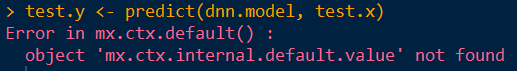
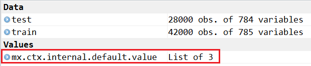
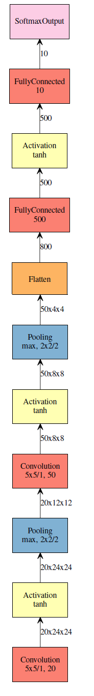

<a href="http://rpubs.com/skydome20/Table" target="_blank">【R系列筆記】</a>    


------   

###※ Kaggle－Digit Recognizer：<a href="https://www.kaggle.com/c/digit-recognizer" target="_blank">https://www.kaggle.com/c/digit-recognizer</a>   
   
   
------   
   
   
#**0. 前言**   
   
> * 這篇筆記主要介紹：「用R實作出深度學習的模型，解決Kaggle上的手寫數字問題(Digit Recognizer)」   
> * 重點會著重在「如何用R撰寫深度學習的模型」，因此並不會詳細講述深度學習(DNN, CNN)的細節。文末有提供一些相關資源，可以自行去學習。    
> * 使用的R套件是`mxnet`。


------   

1998年，被稱為「卷積類神經之父」的 揚·勒丘恩(Yann LeCun) 提出手寫數字的問題。   
當時公開的資料集`MNIST`是根據他所在的實驗室(Mixed National Institute of Standards and Technology)所命名，目的要開發出一個自動辨識系統。   
   
   
當時 揚 已經提出**LeNet**這個卷積類神經網路(CNN: Convolutional Neural Networks)，來解決這個問題。當年美國大多數的銀行，就是用它來識別支票上的數字。   
   
   
2007年，NVIDIA開發出GPU(Graphics Processing Unit)，比一般CPU處理速度快千倍，各種「深度學習」的演算法因而在各領域獲得飛躍性的進展(無人車、人工智慧...)。   
   
------   

「MNIST之於深度學習，如同Hello World!之於程式設計。」  
   
      
R有很多可以實現深度學習/類神經網路的套件(`neuralnet`、`nnet`、`h2o`、`mxnet`)   
而這次，我選擇`mxnet`套件建構以下模型： 

* 深度神經網路(DNN: Deep Neuron Networks)   

* 卷積類神經網路(CNN: Convolutional Neural Networks)   
   
   
相較於其他套件，我看中`mxnet`的優點有四個：   

1. 具有強大的彈性，允許自行設計符合需求的類神經網路模型(下面會有更詳細介紹)。   

2. 支援GPU的運算。   

3. 能實現DNN, CNN, RNN-LSTM...等深度學習演算法。   

4. 同時具有python的版本，寫法幾乎一模一樣，**而且和python另一個深度學習的套件`keras`**寫法也相近；若未來有機會以python實作深度學習，能很快就上手。   


------   

#**1. 資料預處理**   
   
   
關於Digit Recognizer這個問題，在文章開頭的連結內有詳細說明，同時可以下載到訓練和測試資料集：   

* train.csv：42000 * 785 (label + 28 * 28 pixels)

* test.csv：28000 * 784 (28 * 28 pixels)   

```{r, cache=TRUE}
# 42000個觀測值，每一筆代表一張手寫數字的圖片
# 784個自變數： 28 x 28 pixels，以灰階值0~255表示。
# 應變數label，代表這張圖片象徵的數字，
# 也是在測試資料(test.csv)中要預測的值。
train <- read.csv('data/train.csv')
dim(train)

# 28000個觀測值，每一筆代表一張手寫數字的圖片
# 784個自變數： 28 x 28 pixels，以灰階值0~255表示。
# 無label，要預測的
test <- read.csv('data/test.csv')
dim(test)
```   
   
我們可以先畫圖，看一下資料：   
   
```{r, message=FALSE, warning=FALSE, }
# 資料轉換成 28x28 的矩陣
obs.matrix <- matrix(unlist(train[1, -1]), # ignore 'label'
                     nrow = 28,            
                     byrow=T)
str(obs.matrix)

# 用 image 畫圖，顏色指定為灰階值 0~255
image(obs.matrix, 
      col=grey.colors(255))

# 由於原本的圖是倒的，因此寫一個翻轉的函式：
# rotates the matrix
rotate <- function(matrix){
  t(apply(matrix, 2, rev)) 
} 

# 畫出第1筆~第8筆資料的圖
par(mfrow=c(2,4))
for(x in 1:8){
  obs.matrix <- matrix(unlist(train[x, -1]), # ignore 'label'
                              nrow = 28,            
                              byrow=T)
         
  image(rotate(obs.matrix),
               col=grey.colors(255),
               xlab=paste("Label", train[x, 1], sep=": "),
               cex.lab = 1.5
       )
}

```   
   
在建模之前，因為資料裡面的pixels欄位值為0 ~ 255，因此先簡單做個轉換，讓pixels在0~1之間：    
   
```{r}
# data preparation
train.x <- t(train[, -1]/255) # train: 28 x 28 pixels
train.y <- train[, 1]         # train: label
test.x <- t(test/255)         # test: 28 x 28 pixels
```   
   
   
------   
   
   
#**2. 模型建構(mxnet)**   
   
   
由於`mxnet`還沒在CRAN上架，因此從<a href="https://github.com/dmlc/mxnet" target="_blank">Github</a>下載：    
```{r, eval=FALSE}
# download mxnet package from github 
install.packages("drat", repos="https://cran.rstudio.com")
drat:::addRepo("dmlc")
install.packages("mxnet")
```   

```{r, message=FALSE}
require(mxnet)
```   
   
   
準備好套件後，就準備開始建構深度學習的模型：   

------   
   
##**DNN**   
   
   
   
所謂的DNN，就是「多層隱藏層」的類神經網路。   
一般來說，類神經網路的基本型為<a href="http://rpubs.com/skydome20/R-Note8-ANN" target="_blank">筆記(8)</a>介紹的「倒傳遞類神經網路(BPN)」。    
   
   
然而，單層或雙層的BPN，在面對大數據(Big Data)的議題上，其預測效果和處理效率沒有想像中的好(尤其是圖片處理、影音處理、語音處理...)，   
   
   
因此有人提倡引入多層隱藏層，擴展神經網路的「深度」：現在的隱藏層萃取出「input的一些特徵」後，當作下一隱藏層的input。隨著層數越多，能夠辨識的「特徵」也會越明確。以此概念來增加最後的預測效果。   
   
   
不過隨著隱藏層增加，許多問題也會接踵而來：「梯度殘差消失」、「權重數量遞增」...   
因此又有人接著提出「激發函數改為relu」、「Dropout概念」、「min batch」...等想法來解決這些問題。   
   
   
關於DNN的詳情，這裡不多加贅述，可以參照台大李宏毅老師的講義：
<a href="http://www.slideshare.net/tw_dsconf/ss-62245351" target="_blank">一天搞懂深度學習</a>。   
   
   
------   
    
    
以下是DNN的程式碼：   
   
   
```{r}

# 輸入層
data <- mx.symbol.Variable("data")

# 第一隱藏層: 500節點，狀態是Full-Connected
fc1 <- mx.symbol.FullyConnected(data, name="1-fc", num_hidden=500)
# 第一隱藏層的激發函數: Relu
act1 <- mx.symbol.Activation(fc1, name="relu1", act_type="relu")
# 這裡引入dropout的概念
drop1 <- mx.symbol.Dropout(data=act1, p=0.5)

# 第二隱藏層: 400節點，狀態是Full-Connected
fc2 <- mx.symbol.FullyConnected(drop1, name="2-fc", num_hidden=400)
# 第二隱藏層的激發函數: Relu
act2 <- mx.symbol.Activation(fc2, name="relu2", act_type="relu")
# 這裡引入dropout的概念
drop2 <- mx.symbol.Dropout(data=act2, p=0.5)

# 輸出層：因為預測數字為0~9共十個，節點為10
output <- mx.symbol.FullyConnected(drop2, name="output", num_hidden=10)
# Loss Function: Softmax
dnn <- mx.symbol.SoftmaxOutput(output, name="dnn")
```   
> 【註】   
> 因為輸出層的結果是類別型態(0~9的數字)，因此最後一行使用的是softmax。  
> 若現在要預測的是連續型態，就改為`mx.symbol.LinearRegressionOutput()`)
   
   
------   
    
   
就是這麼簡單。   
   
   
透過一行一行不同功能的函式，自行設計屬於自己的深度學習模型，是一種相當具有彈性的寫法。    
   
   
最後，我創造了一個具有兩層隱藏層(500, 400)，搭配激發函數Relu，以及引入Dropout概念的類神經網路。   
   
   
我們可以看網路中的參數資訊，以及視覺化其結構：   
   
   
```{r}
# 神經網路中的各個參數的資訊
arguments(dnn)

# 視覺化DNN結構
graph.viz(dnn$as.json(),
          graph.title= "DNN for Kaggle－Digit Recognizer"
          )

```   
   
> 【註】   
> R的視覺化函式`graph.viz`，缺點是無法調整其大小，因此當神經網路的結構複雜實，輸出的圖片相當小。   
> 然而，在python上似乎並無這個問題(?)。這部分我不太確定，但有看過python畫的圖的確比較好。歡迎隨時給予指教！  
      
   
------   
    
   
接下來，就拿`train.x`來訓練剛剛創造的神經網路，內部參數的設定十分重要：   
   
   
```{r, cache=TRUE, warning=FALSE}
mx.set.seed(0) 

# 訓練剛剛創造/設計的模型
dnn.model <- mx.model.FeedForward.create(
      dnn,       # 剛剛設計的DNN模型
      X=train.x,  # train.x
      y=train.y,  #  train.y
      ctx=mx.cpu(),  # 可以決定使用cpu或gpu
      num.round=10,  # iteration round
      array.batch.size=100, # batch size
      learning.rate=0.07,   # learn rate
      momentum=0.9,         # momentum  
      eval.metric=mx.metric.accuracy, # 評估預測結果的基準函式*
      initializer=mx.init.uniform(0.07), # 初始化參數
      epoch.end.callback=mx.callback.log.train.metric(100)
)
```   
   
大部分的參數都和基本的BPN概念一樣，就不多加解釋。   
   
   
但其中有一個參數值得關注，那就是倒數第三個的參數：**`eval.metric`**。   
   
   
   
因為我使用的是`mx.metric.accuracy	`，用來評估「預測的準確率」，所以在訓練模型時的輸出才會是**Train-accuracy**。   
如果現在要評估「連續數值」的預測效果，可以改使用`mx.metric.mae`、`mx.metric.rmse`，這樣就會用**MSE愈小愈好**的方式來訓練模型。   
  
   
   
但最棒的是，如果自己有特殊需求(例如，我想看的是**`R-Squared`**)，mxnet允許我們可以自行設計屬於自己的評估函式，再將參數設定成： `eval.metric = my.eval.metric`就好：      
   
```{r}
# define my own evaluate function (R-squared)
my.eval.metric <- mx.metric.custom(
                        name = "R-squared", 
                        function(real, pred) {
                            mean_of_obs <- mean(real)
                        
                            SS_tot <- sum((real - mean_of_obs)^2)
                            SS_reg <- sum((predict - mean_of_obs)^2)
                            SS_res <- sum((real - predict)^2)
                            
                            R_squared <- 1 - (SS_res/SS_tot)
                            R_squared
                        }
                  )

```
   
   
------   
    
最後進行預測：       
    
    
```{r, eval=FALSE}

# test prediction 
test.y <- predict(dnn.model, test.x)
test.y <- t(test.y)
test.y.label <- max.col(test.y) - 1

# Submission format for Kaggle
result <- data.frame(ImageId = 1:length(test.y.label),
                     label = test.y.label)
```   
> 【註】   
> 在預測時，有時會出現下圖的ERROR : 找不到`mx.ctx.internal.default.value`。 
>    
> 這是因為在建模過程中，不小心刪除Environment裡面的這個值。   
> 解決方法是，關掉Rsutido後，再重新**`require(mxnet)`**一次。   
> 只要確定Environment中有出現這個值就沒問題了：   
> 
   

**Kaggle Score = 0.97229**
   
------   
   
   
##**CNN**   
    
在研究CNN時，會發現許多公司(Google、Microsoft...)提出各自的結構。其中沒有好壞之分，端看使用者是如何設計，滿足各自的需求。   
   
CNN詳細的演算法和設計結構不在這裡贅述，可以參考以下這些文章：   
   
* <a href="http://josephpcohen.com/w/visualizing-cnn-architectures-side-by-side-with-mxnet/" target="_blank">Visualizing CNN architectures side by side with mxnet</a>   
   
   
* <a href="http://cs231n.github.io/convolutional-networks/" target="_blank">CS231n: Convolutional Neural Networks for Visual Recognition.</a>   

  
   
------   
   
   
我將實作的是 揚·勒丘恩 1998年所提出的CNN：<a href="http://yann.lecun.com/exdb/lenet/" target="_blank">LeNet</a>：      

> (LeNet, 28x28, 1998)   
> 
   
   
```{r}
# 輸入層
data <- mx.symbol.Variable('data')

# 第一卷積層，windows的視窗大小是 5x5, filter=20
conv1 <- mx.symbol.Convolution(data=data, kernel=c(5,5), num_filter=20, name="1-conv")
# 第一卷積層的激發函數：tanh
conv.act1 <- mx.symbol.Activation(data=conv1, act_type="tanh", name="1-conv.act")
# 第一卷積層後的池化層，max，大小縮為 2x2
pool1 <- mx.symbol.Pooling(data=conv.act1, pool_type="max", name="1-conv.pool",
                           kernel=c(2,2), stride=c(2,2))

# 第二卷積層，windows的視窗大小是 5x5, filter=50
conv2 <- mx.symbol.Convolution(data=pool1, kernel=c(5,5), num_filter=50, name="2-conv")
# 第二卷積層的激發函數：tanh
conv.act2 <- mx.symbol.Activation(data=conv2, act_type="tanh", name="2-conv.act")
# 第二卷積層後的池化層，max，大小縮為 2x2
pool2 <- mx.symbol.Pooling(data=conv.act2, pool_type="max", name="2-conv.pool",
                           kernel=c(2,2), stride=c(2,2))

# Flatten
flatten <- mx.symbol.Flatten(data=pool2)
# 建立一個Full-Connected的隱藏層，500節點
fc1 <- mx.symbol.FullyConnected(data=flatten, num_hidden=500, name="1-fc")
# 隱藏層的激發函式：tanh
fc.act1 <- mx.symbol.Activation(data=fc1, act_type="tanh", name="1-fc.act")

# 輸出層：因為預測數字為0~9共十個，節點為10
output <- mx.symbol.FullyConnected(data=fc.act1, num_hidden=10, name="output")
# Loss Function: Softmax 
cnn <- mx.symbol.SoftmaxOutput(data=output, name="cnn")
```
   
   
我們一樣可以看CNN裡面參數的資訊，和視覺化其結構：   
   
   
```{r, eval=FALSE}
# 神經網路中的各個參數的資訊
arguments(cnn)

# 視覺化CNN結構
graph.viz(cnn$as.json(),
          graph.title= "CNN for Kaggle－Digit Recognizer"
          )

```   
   
   
------   
   
   
然而，在訓練之前有一件事情要注意，因為LeNet有要求既定的input格式()，和DNN不一樣，我們不能直接拿`train.x`來訓練，得先將`train.x`和`test.x`轉換成一個四維矩陣，才能進行訓練： 

```{r}
# Transform matrix format for LeNet 
train.array <- train.x
dim(train.array) <- c(28, 28, 1, ncol(train.x))
test.array <- test.x
dim(test.array) <- c(28, 28, 1, ncol(test.x))

```   

   
```{r, cache=TRUE, warning=FALSE}
mx.set.seed(0)

# 訓練剛剛設計的CNN模型
cnn.model <- mx.model.FeedForward.create(
      cnn,       # 剛剛設計的CNN模型
      X=train.array,  # train.x
      y=train.y,  #  train.y
      ctx=mx.cpu(),  # 可以決定使用cpu或gpu
      num.round=10,  # iteration round
      array.batch.size=100, # batch size
      learning.rate=0.07,   # learn rate
      momentum=0.7,         # momentum  
      eval.metric=mx.metric.accuracy, # 評估預測結果的基準函式*
      initializer=mx.init.uniform(0.05), # 初始化參數
      epoch.end.callback=mx.callback.log.train.metric(100)
)

```


------   

最後預測：   
   
```{r, eval=FALSE}
# test prediction 
test.y <- predict(cnn.model, test.array)
test.y <- t(test.y)
test.y.label <- max.col(test.y) - 1

# Submission format for Kaggle
result <- data.frame(ImageId = 1:length(test.y.label),
                     label = test.y.label)
```   
   
**Kaggle Score = 0.98871**   
   

------   

   
#**總結**    

深度學習的演算法，就像是堆積木一樣：先設計出其神經網路的結構，再用程式碼一一來堆砌！   


由於所有操作都是在windows 7上，運算單元是CPU而非GPU，因此運算效率並不理想。   
   
之後，我重新設計修改LeNet的結構，得到更好的預測效果，再上傳到Kaggle，因此下面CNN的預測分數，會和前面提到的不太一樣。   
   
以下是我自己 DNN 和 CNN-LeNet 得到的預測分數：   
   
* DNN : **0.97229**
   
* CNN-LeNet : **0.99129**    
   

> (2016-11-19)  在Kaggle的排名中，獲得185 / 1261，算是不錯的結果。   
>    
   
   
當然，如果要更進一步提升預測率，可以從以下兩個點著手：   

1. 設計其它結構的神經網路 (DNN/CNN/RNN-LSTM)   
2. 基本參數的設定(Tuning)   

但我認為花時間將0.991提升到0.999這種事情，感覺很沒必要啦XD   
   
   
與其計較小數點後兩、三位的準確率，不如維持這樣的心態：「當學習到新的模型或演算法(例如，LASSO, SVM, Tree, GBM...)時，把手寫數字的問題拿來當成實作練習。」   
   
   
這樣，或許才能真正注意到重要的事情。   
    
    
It's still a long way to go~   

------   
   
   
#**Reference**    

* Youtube : <a href="https://www.youtube.com/watch?v=_1Cyyt-4-n8" target="_blank">Deep Learning and the Future of AI | Yann LeCun | Talk</a>  

* Kaggle : <a href="https://www.kaggle.com/kobakhit/digit-recognizer/digital-recognizer-in-r" target="_blank">Digit Recognizer in R</a>  
   
* <a href="https://github.com/dmlc/mxnet" target="_blank">Github-mxnet</a>       
   
* 台大李宏毅老師 : <a href="http://www.slideshare.net/tw_dsconf/ss-62245351" target="_blank">一天搞懂深度學習</a>   
   
* 揚·勒丘恩(Yann LeCun) : <a href="http://yann.lecun.com/exdb/lenet/" target="_blank">LeNet-5</a>   
   
* <a href="https://turi.com/products/create/docs/graphlab.mxnet.html" target="_blank">Advanced Deep Learning with MXNet (Beta)</a>   
   
* <a href="http://mxnet.io/tutorials/r/fiveMinutesNeuralNetwork.html" target="_blank">Develop a Neural Network with MXNet in Five Minutes</a>  

* <a href="http://josephpcohen.com/w/visualizing-cnn-architectures-side-by-side-with-mxnet/" target="_blank">Visualizing CNN architectures side by side with mxnet</a>  
   
* <a href="http://cs231n.github.io/convolutional-networks/" target="_blank">CS231n: Convolutional Neural Networks for Visual Recognition.</a>   

* <a href="http://www.parallelr.com/r-deep-neural-network-from-scratch/" target="_blank">R for Deep Learning</a>  

* <a href="http://blog.csdn.net/zouxy09/article/details/8775518" target="_blank">http://blog.csdn.net/zouxy09/article/details/8775518</a>  

* <a href="http://www.gegugu.com/2016/08/12/2372.html" target="_blank">史丹佛CS224d深度學習課程第八彈： RNN，MV-RNN與RNTN</a>  
  

  
