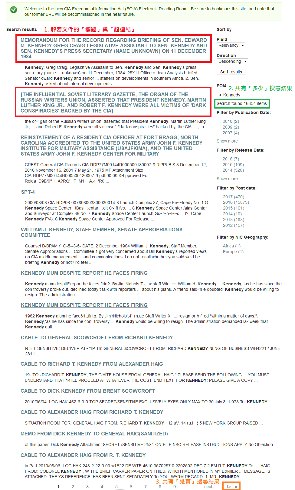
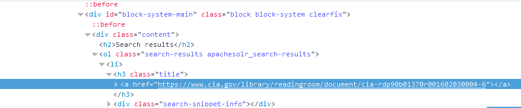
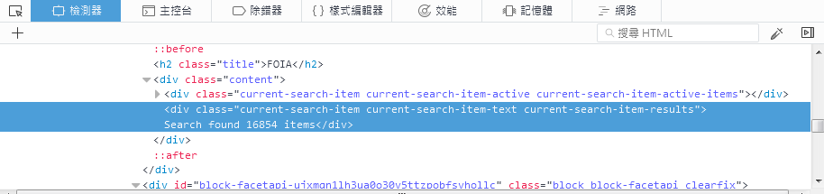
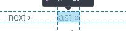
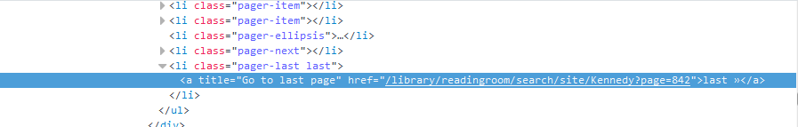
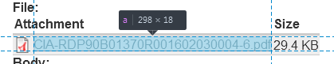
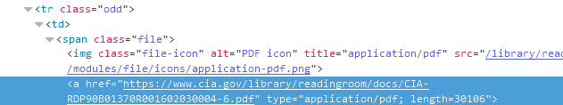
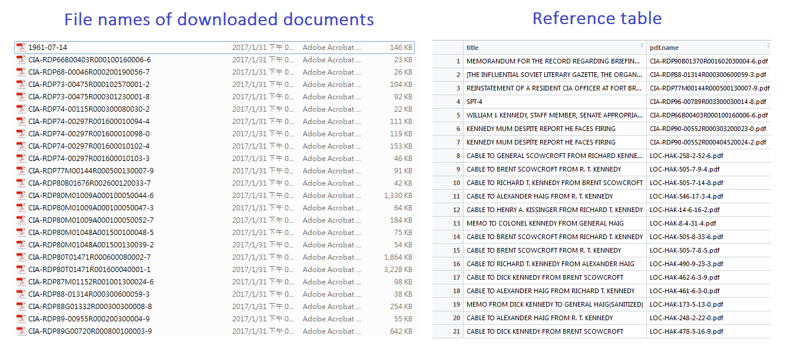

<a href="http://rpubs.com/skydome20/Table" target="_blank">【R系列筆記】</a>    


------   
   
   
#**0. 前言**   
   
> (本篇筆記適合對網路爬蟲有一定概念的人；若不懂相關知識，最後的Reference有提供一些學習資源，請先看過後再來閱讀。)     
>      
> 本篇筆記的<a href="https://github.com/skydome20/crawler_CIA_CREST" target="_blank">程式碼已經在Github上釋出。</a>     
>   
> * 0. 前言 
> * 1. 解析CIA (CREST project)的網址。
> * 2. 用xml2解析CIA搜尋結果的資訊。
> * 3. 下載解密文件。
> * 4. 進階：自動化整個流程(成果展現)。    
   
------   

2017/01/18，美國中央情報局(CIA)做出一件讓全世界驚奇的事情，就是把93萬份解密文件釋出到官網上，供社會大眾自由下載查閱。此事立刻讓各國媒體相繼報導：   
   

* <a href="http://technews.tw/2017/01/23/x-files-from-cia/" target="_blank">
真正《X 檔案》解密！美國中情局 CIA 的 90 萬份上網公開解密</a>    
* <a href="https://www.thenewslens.com/article/59790" target="_blank">CIA解密93萬筆文件：幽浮、超能力、「共軍解放台灣」都是真的 </a>   
* <a href="http://www.ntdtv.com/xtr/b5/2017/01/20/a1307779.html" target="_blank">CIA解密檔案 7萬份中國情報曝光</a>   
* <a href="https://www.wired.com/2017/01/ufos-psychics-spies-cia-just-put-12m-pages-files-online-start/" target="_blank">The Best of the CIA's 12-Million Page CREST Archive</a>    
   
------   
   
此項專案名為CREST(the CIA Record Search Tool；「中情局記錄搜尋工具」)。從<a href="https://www.cia.gov/library/readingroom/collection/crest-25-year-program-archive" target="_blank">官網</a>進去後，會看見這樣的畫面：   

<br />
   
<br />   
   
本來，民眾得前往美國馬里蘭州（Maryland的國家檔案館)，使用裡面特定的4台電腦上才能查詢；   
   
不過現在大家都可以自由上網，輸入關鍵字，並且下載相關的解密文件。   
   
例如，當輸入「**Kennedy**」(甘迺迪)時，跑出的結果如下：   

<br />
   
<br />   
   
點擊第一個結果，可以有更詳細的資訊，以及該文件的pdf下載點：   

<br />
   
<br />   
   
在玩賞一番(?)這項服務後，發現裡面不少資料都相當有趣。   
   
然而，由於資料庫太過龐大，光是用人眼看完每一篇文件的標題，就得花上不少時間；若是要下載大量的解密文件，一篇一篇點進去下載，感覺是一個很蠢的方法。   
   
因此，我就萌生了一個想法：**何不用R寫一個網路爬蟲？**   
   
一個用來爬CIA網站、可以很快知道所有文章標題、協助下載大量解密文件的網路爬蟲(Web Crawler)，應該會很酷吧？   
     
於是，這篇筆記就誕生了！   
        
<br />   

------   

#**1. 解析CIA (CREST project)的網址**   
    
在輸入關鍵字搜尋解密文件時，CIA的網站有一個很明顯的改變：   
   
(搜尋**Kennedy**前的網址：https://www.cia.gov/library/readingroom/collection/crest-25-year-program-archive)    
   
(搜尋**Kennedy**後的網址：https://www.cia.gov/library/readingroom/search/site/Kennedy)   
   
   
<br />
   
<br />   
   
   
然而，一個頁面不可能呈現出所有的結果；   
   
因此當看下一頁的結果時，會發現網址後面又增加了一些數字(第一頁對應的是page=0，第二頁page=1...以此類推)：   
   
<br />
   
<br />   
   
因此根據以上觀察的結果，我們可以得知CIA搜尋結果的網址型態如下：   
   
```{r, eval=FALSE}
https://www.cia.gov/library/readingroom/search/site/關鍵字?page=頁碼
```   
      
其中，「**關鍵字**」是我們所輸入的；而「**頁碼**」是對應的結果頁數，從0開始。   
   
換句話說，這樣的型態可以讓我們寫一個程式，自動回傳結果的網址：   
     
```{r}
# Parameters Settings
query = 'Kennedy'    # keyword for query
pages = c(0,9,19)    # pages where you want to search

# basic CIA (CREST project) URL: 'https://www.cia.gov/library/readingroom/search/site/'
result.urls = paste('https://www.cia.gov/library/readingroom/search/site/', 
                     paste(query, paste('page=', pages, sep=''), sep='?'),  
                     sep='')
result.urls

```   
   
(上面範例回傳的網址是：搜尋**Kennedy**後，第**1, 10, 20**頁的結果網址。若有興趣，可以用瀏覽器打開來看看)   
   
這個程式只要在一開始設定好參數(**query, pages**)，就可以回傳對應的結果網址。   
   
而下一步，就是用xml2來分析這些結果網址。   
      
<br />   
   
------   
   
#**2. 用xml2解析CIA搜尋結果的資訊**   

有了結果網址後，我們可以用瀏覽器(browser)打開，觀察CIA結果的網頁中，有哪些資訊可能是我們需要的：   

```{r}
# Now we take the first result url to observe the infromation on this website
result.urls[1]
```   

當用瀏覽器打開結果網址以後，會呈現出下面的結果，並標示出其中我所需要的資訊：   
   
**1. 每個解密文件的「標題」和對應的「超連結」。**   
**2. 共有「多少」的搜尋結果。**   
**3. 共有「幾頁」搜尋結果。**
   
<br />
   
<br />   
   
要得到以上三點資訊，我們要查看網頁的html原始碼，方法是按**F12**，便會在瀏覽器上出現一個「檢測器」。   
   
(我以Firefox為例, 而Chrome也適用)：
   
<br />
   
<br />   
   
在左上角有一個「檢測頁面中元素」的按鈕，可以協助判斷網頁中每個元素所對應的原始碼是哪些。   


     
------   


###**(1) 解密文件的「標題」和對應的「超連結」。**   
   
將滑鼠移動到解密文件的標題時，會出現下面這個現象：   
    
<br />
   
<br />   
   
對應的html碼則會顯示在「檢測器」中：   
     
<br />
   
<br />   
   
有了上面的資訊，便可以撰寫程式碼。使用的套件是`xml2`，主要會用到下面這些函式：

* read_html()：將網址所對應的html頁面，儲存成一個物件。   
   
* xml_find_all()：找到符合「規則」的所有html原始碼。

* xml_text()：從html原始碼中，萃取「內容」的資訊。

* xml_attr()：從html原始碼中，萃取「屬性」的資訊。   
     
     
(若看不懂以下的程式碼，請先參考頁底的Reference，或是閱讀<a href="http://www.slideshare.net/tw_dsconf/r-64232974" target="_blank">投影片p.13~p.18</a>。)   
   
```{r, message=F,cache=TRUE}
require(xml2)
# 讀取url，將html頁面儲存成一個物件
html.page = read_html(url(result.urls[1]))
# 根據上圖的資訊，寫一個xpath
xpath = "//*[@class='search-results apachesolr_search-results']/li/h3/a" 
target = xml_find_all(html.page, xpath)
# 解密文件的「標題」
title = xml_text(target)
# 解密文件的「超連結」
download.url = unlist(xml_attr(target, "href"))
# 最後，將這頁的資訊儲存成一個data frame
page.info = data.frame(title=title, url=download.url, stringsAsFactors = F)
tail(page.info)


```   
     
------   


###**(2) 共有「多少」搜尋結果**   
   
將滑鼠移動到呈現多少筆搜尋結果的元素上時，會出現下面這個現象：   
    
<br />
   
<br />   
   
對應的html碼則會顯示在「檢測器」中：   
     
<br />
   
<br />   

```{r, message=F,cache=TRUE}
require(xml2)
html.page = read_html(url(result.urls[1]))

# find nodes which match the 'pattern' of xpath
xpath = "//*[@class='current-search-item current-search-item-text current-search-item-results']" 
target = xml_find_all(html.page, xpath)

# the result of search items
xml_text(target)
```     
   
換句話說，**Kennedy**這個關鍵字，會有16854篇解密文件。   
     
------   


###**(3) 共有「幾頁」搜尋結果**   
   
將滑鼠移動到最下面的「last」元素上時，會出現下面這個現象：   
    
<br />
   
<br />   
   
對應的html碼則會顯示在「檢測器」中：   
     
<br />
   
<br />   

```{r, message=F,cache=TRUE}
require(xml2)
html.page = read_html(url(result.urls[1]))

# find nodes which match the 'pattern' of xpath
xpath = "//*[@class='pager-last last']/a"
target = xml_find_all(html.page, xpath)

# last page url
last.page.url = xml_attr(xml_find_all(html.page, xpath), "href")
last.page.url
# last page number
strsplit(last.page.url, split="page=")[[1]][2]
```     
   
換句話說，整個搜尋結果共有842頁。   
   
<br />   
   
------   

#**3. 下載解密文件**   

上一步，我們每一個解密文件的「標題」與「超連結」，接下來就是如何用R來下載這些解密文件。   
   

用滑鼠點擊第一個解密文件的標題，會出現像這樣的畫面：   
     
<br />
   
<br />   
   
用和前面一樣的手法，知道下載網址所對應的html：
     
<br />
   

   
<br />   
   
於是，根據「超連結」，我們先讀取下載頁面的html，然後用xpath找出對應的下載連結：   
   
```{r, message=F, cache=T}
require(xml2)
# 先跳到第一個解密文件的下載頁面
html.page = read_html(url(page.info$url[1]))

# 然後用xpath分析
xpath = "//*[@class='odd']/td/span/a"
target = xml_find_all(html.page, xpath)

# 找出下載連結
doc.url = as.character(unlist(xml_attr(target, "href")))
doc.url
# 然後下載成一個名為'1_CIA_file.pdf'的檔案
download.file(doc.url, '1_CIA_file.pdf', method='auto', mode='wb')
```   
**(注意，使用`download.file()`時，參數`mode='wb'`一定要這樣設定，否則下載的文件會有錯誤)**   
   
最後，打開的PDF檔案就會像這樣：   
     
<br />
   
<br />   
   
<br />   
   
------   

#**4. 進階：自動化整個流程(成果展現)**   

前面1~3章的重點，主要著重在如何用R來解析CIA的網站，實作出一些基本的程式碼。   
   
但若要達到**彈性且自動化**下載所有文件，單單這樣是不足的。   
   
因此我進一步強化前面提及的程式碼，寫成各自功能的function，發表在Github上。   
   
<a href="https://github.com/skydome20/crawler_CIA_CREST" target="_blank">Github下載點在這裡</a>，其中：   
      
1. `crawler_CIA_CREST.R`：主要有3個functions。

2. `main.R`： 執行的主要程式。 

下載好以後，在`crawler_CIA_CREST.R`裡面有3個functions：

1. `basic.info.query.CIA_CREST(query)`：參數是關鍵字，回傳初步的搜尋結果。

2. `parsing.pages.CIA_CREST(query, pages)`：參數是關鍵字和指定頁碼，回傳parse.table。

3. `download.doc.CIA_CREST(parse.table)` ：參數是parse.table，自動下載解密文件到相關路徑(relative path)，回傳對照表(標題-檔名)。


```{r, echo=F, message=F}
# http://technews.tw/2017/01/23/x-files-from-cia/
# This is new CIA Freedom of Information Act (FOIA) Electronic Reading Room (ERR),
# called project 'CREST'': https://www.cia.gov/library/readingroom/collection/crest-25-year-program-archive

require(xml2)

#============================================================================#
#================= Get basic information of a given query ===================#
#============================================================================#
basic.info.query.CIA_CREST <- function(query){
  # try-catch: to avoid unexpect error
  tryCatch({
    # combine CIA url and your query
    init.url = paste('https://www.cia.gov/library/readingroom/search/site/', query, sep='')
    
    # read the html page
    html.page = read_html(init.url)
    
    # use 'xpath' to get the number of search items
    xpath = "//*[@class='current-search-item current-search-item-text current-search-item-results']" 
    search.items = xml_text(xml_find_all(html.page, xpath))
  
    # use 'xpath' to get the last page number
    xpath = "//*[@class='pager-last last']/a"
    last.page.url = xml_attr(xml_find_all(html.page, xpath), "href")
    last.page.num = strsplit(last.page.url, split="page=")[[1]][2]
    
    # print out basic information
    cat("The search query is for CIA Freedom of Information Act (FOIA) Electronic Reading Room (ERR)")
    cat("\n")
    cat("URL: https://www.cia.gov/library/readingroom/collection/crest-25-year-program-archive")
    cat("\n\n")
    cat(paste('Your query is : ', query, sep='')) 
    cat("\n")
    cat(search.items)
    cat("\n")
    cat(paste('The results contain 0 ~ ', last.page.num, ' pages', sep=''))
    cat("\n")
  }, # try-catch error
  error = function(e) {
    cat('Wrong query keywords or Unexpect error')
  }

  )
}

#============================================================================#
#================= Parse and return result table from CIA FOAI ERR===========#
#============================================================================#
parsing.pages.CIA_CREST <- function(query, pages){
  # try-catch: to avoid unexpect error
  tryCatch({
    # Search-Pages Array based on your.query and page.nums
    search.pages = paste('https://www.cia.gov/library/readingroom/search/site/', # basic url
                         paste(query, paste('page=', pages, sep=''), sep='?'), # query & pages
                         sep='')
    
    # Start parsing and return (title, url) from each page
    parse.table = data.frame()  # (title, url, page, corres.page) table
    for(page.url in search.pages){
      # read the html page
      html.page = read_html(page.url)
      
      # use 'xpath' to get (title, url) table for each page
      xpath = "//*[@class='search-results apachesolr_search-results']/li/h3/a"
      target = xml_find_all(html.page, xpath)
      # result table of current page
      current.page= data.frame(title = xml_text(target),                # title
                               download.url = unlist(xml_attr(target, "href")), # download url
                               page = pages[which(page.url == search.pages)],  # page num
                               correspond.page = page.url, # correspond.page.url
                               stringsAsFactors = F)
      
      # all results by combining each page 
      parse.table = rbind(parse.table, current.page)
    }
    cat('Success to return a parse.table')
    # return the final parse table after parsing
    parse.table
  }, # try-catch error
  error = function(e) {
    cat('Out of page range or Unexpect error')
  }
  
  )
}

#============================================================================#
#==== Download documents from talbe returned by parsing.pages.CIA_CREST() ===#
#============================================================================#

download.doc.CIA_CREST <- function(parse.table){
  # try-catch: to avoid unexpect error
  tryCatch({
    # download url should be chr type
    parse.table$`title` = as.character(parse.table$`title`)
    parse.table$`download.url` = as.character(parse.table$`download.url`)
    
    
    # reference table
    reference.table = data.frame()
    for(ind in 1:length(parse.table$`download.url`)){
      # read the html page
      html.page = read_html(parse.table$`download.url`[ind])
      
      # use 'xpath' to get  for each page
      xpath = "//*[@class='odd']/td/span/a"
      target = xml_find_all(html.page, xpath)
      
      # documents information
      doc.name = as.character(xml_text(target))                
      doc.url = as.character(unlist(xml_attr(target, "href")))
      
      # the download page is not collection
      if(length(doc.name) == 1 ){
        download.file(doc.url, doc.name, method='auto', mode='wb')
        cur.table = data.frame(title = parse.table$`title`[ind],
                               pdf.name = doc.name,
                               stringsAsFactors = F)
        
        reference.table = rbind(reference.table, cur.table)
      }
      # the download page is collection, not handle yet
      else{}
    }
    
    cat('Success to download all files and return a reference.table')
    # return reference table (title, doc.name)
    reference.table
  }, # try-catch error
  error = function(e) {
    conditionMessage(e)
    cat('Unexpect error')
    #print(ind)
    #print(parse.table$`title`[ind])
    #print(parse.table$`download.url`[ind])
  }
    
  )
}
```

打開main.R時，你會發現裡面已經有一些範例(examples)。   
   

下面會詳加解釋、示範這三個functions的功能。   
     
------   


## (1) 一開始先匯入`crawler_CIA_CREST.R`：   

```{r, eval=F}
source("crawler_CIA_CREST.R")
```


## (2) basic.info.query.CIA_CREST(query)   
   
這個函式會初步解析搜尋結果的頁面，顯示相關資訊出來，讓使用者能夠先得知自己想要查詢關鍵字的資訊。   
   
例如，搜尋「UFO」，會得到共有**「1738」**的搜尋結果，從**0 ~ 86 頁**的資訊：   

```{r}
# Give a query 
basic.info.query.CIA_CREST(query = "UFO") 
```   
   
搜尋「Kennedy」，會得到共有**「16854」**的搜尋結果，從**0 ~ 842 頁**的資訊：   
   
```{r}
# Give a query 
basic.info.query.CIA_CREST(query = "Kennedy") 
```   
   
有了上面的資訊後，我們就知道要搜尋的主題中，頁碼的限制範圍是多少(例如，Kennedy是0~842頁)。   
   

## (3) parsing.pages.CIA_CREST(query, pages)   

考量到有時候並不需要下載「所有」的解密文件，或許只要「前十頁」的解密文件就好。   

因此，我在這個函式添加**pages**的參數，讓使用者可以給定頁碼。   

由上面的資訊，我們知道「Kennedy」的結果是 0 ~ 842 頁，是為了讓使用者知道頁碼的限制範圍，避免在給定頁碼時超出範圍。   

假使，現在我們只需要「Kennedy」這個主題「前十頁」的搜尋結果，那就可以先設定好參數：   
   
```{r, cache=T}
your.query = 'Kennedy'
page.nums = c(0:9)     # top 10 pages

# return a parse.table
parse.table = parsing.pages.CIA_CREST(your.query, page.nums)
```   

最後，這個函式會回傳一個parse.table，具有四個欄位：   
   
1. title : 解密文件的「標題」。   
   
2. download.url : 對應「超連結」。   
   
3. page : 所在的「頁碼」。   
   
4. correspond.page : 所在的「頁面網址」。
   
     
<br />
   
<br />   
   
這個parse.table所包含的，就是「Kennedy」這個主題「前十頁」的所有搜尋結果。   
   
如果想要下載這些解密文件，那就要用到最後一個函式。   

## (4) download.doc.CIA_CREST(parse.table)   
   
將上一個函式回傳的parse.table，當作參數，這個函式會自動開始下載所有的解密文件(.pdf)到相對路徑的資料夾內。

```{r, eval=F}
# download files according to the parse.table from parsing.pages.CIA_CREST()
# and return a reference.table
referece.table = download.doc.CIA_CREST(parse.table)
```   
   
注意的是，這裡會回傳一個對照表，因為下載的pdf檔名是CIA編碼的命名；對照表可以協助對應解密文件的「標題」，避免因編碼的命名而無從得知文件的主題。
     
<br />
   
<br />   
   
   
最後，程式碼會像這樣(main.R)：

```{r, eval=F}
# This is a example for downloading CIA files of 'Kennedy' in top 10 pages  

   source("crawler_CIA_CREST.R")

#=== 1. Give a query to get basic information ===#
   basic.info.query.CIA_CREST(query = "Kennedy") 

#=== 2. Parse results according to given query and pages ===#
   your.query = 'Kennedy'
   page.nums = c(0:9)    # top 10 pages
   # return a parse.table
   parse.table = parsing.pages.CIA_CREST(your.query, page.nums)

#=== 3. Auto-download files according to the parse.table ===#
   # download files according to the parse.table from parsing.pages.CIA_CREST()
   # and return a reference.table
   reference.table = download.doc.CIA_CREST(parse.table)

```

<a href="https://github.com/skydome20/crawler_CIA_CREST" target="_blank">(程式碼皆發表在Github)</a>    

 

------
    
#**總結**    

作為資料科學家，有時候要自己去蒐集資料，網路爬蟲是常用的手法之一。   
   
平常可以看到python, java爬蟲的文章，卻鮮少看見用R實作一個系統性的網路爬蟲程式。   

剛好這次CIA解密文件的新聞頗為有趣，我本身又滿喜歡R的，於是就寫出這篇筆記，希望有所幫助。

值得一提的是，這次使用的套件是**`xml2`**，但有更多人傾向使用**`rvest`**來爬蟲。(因此網路上**`rvest`**的文章比**`xml2`**還多，要學習的話會更為容易)   

兩者的基本觀念是一模一樣的，只是寫法會不太一樣。   


It's still a long way to go~

------   
   
   
#**Reference**    

* 大數學堂 : <a href="http://www.largitdata.com/course/1/" target="_blank">什麼是網路爬蟲?</a>   

* <a href="https://zh.wikipedia.org/zh-tw/XPath" target="_blank">什麼是xpath？</a>  

* <a href="http://www.slideshare.net/tw_dsconf/r-64232974" target="_blank">手把手教你 R 語言資料分析實務</a>  

* <a href="https://blog.rstudio.org/2015/04/21/xml2/" target="_blank">Parse and process XML (and HTML) with xml2</a>  
   
* <a href="https://github.com/skydome20/crawler_CIA_CREST" target="_blank">crawler_CIA_CREST (on Github)</a>    


