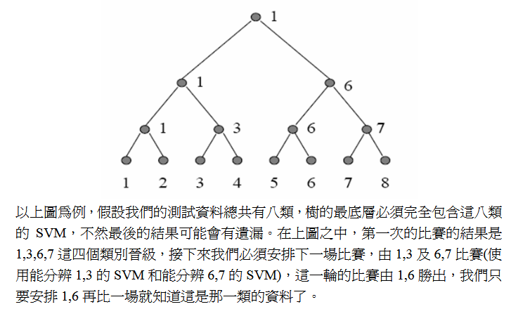
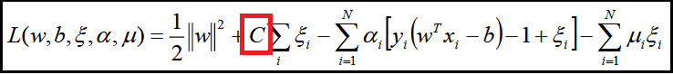
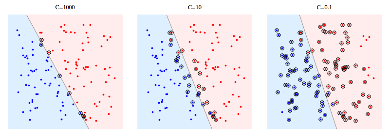

<a href="http://rpubs.com/skydome20/Table" target="_blank">【R系列筆記】</a>  

------
  
本篇內容，會繼續介紹一些常用的資料探勘模型：

> * **0. 簡言**
> * **1. Support Vector Machine(SVM)**：如何用SVM來分類(類別)。
> * **2. SVM在多元分類(multi-class)的技巧**：介紹One-against-Rest和One-against-One的手法。
> * **3. Support Vector Regression(SVR)**：如何用SVR來預測(連續)。
> * **4. 參數討論**：討論SVM中的參數意義：Cost(C), Epsilon(ε), Gamma。
> * **5. 參數調整(Tune Parameters)**：如何調整SVM的參數，讓模型表現出最佳狀態。
   
------

## 0. 簡言   
   
今天要介紹的是<a href="http://www.cs.uvm.edu/~icdm/algorithms/10Algorithms-08.pdf" target="_blank">Top 10 algorithms in data mining</a>之中的SVM，也就是「支持向量機」，Support Vector Machine。   

SVM是一種知名的二元分類器(binary classifier)，由俄羅斯的統計學家Vapnik
等人所提出，一種基於統計學習理論的演算法。

簡單地說，SVM是一種監督式學習的演算法，試圖從資料中建構一個超平面(hyperplane)，將資料區分成兩個類別(2 classes)，最後進行預測/分類。   

若沒有學過SVM的人，光看上面這句話一定一頭霧水。但我也不打算在此解釋SVM演算法的細節與延伸。有興趣的話，可以參考下面的連結自我學習：

- <a href="https://www.youtube.com/user/hsuantien/videos" target="_blank">林軒田-機器學習技法</a>   

- <a href="http://www.cmlab.csie.ntu.edu.tw/~cyy/learning/tutorials/SVM2.pdf" target="_blank">Support Vector Machines 
簡介(林宗勳)</a>  

- <a href="https://goo.gl/qt57Z6" target="_blank">逍遙工作室-支持向量機</a>   

- <a href="https://goo.gl/E9eRFm" target="_blank">逍遙工作室-非線性支持向量機(non-linear SVMs)</a>   

- <a href="http://www.listendata.com/2017/01/support-vector-machine-in-r-tutorial.html" target="_blank">Support Vector Machine Simplified using R </a> 


(強烈建議先將SVM的演算法弄熟，再繼續往下閱讀)   

最後，本篇筆記會使用<a href="http://www.csie.ntu.edu.tw/~cjlin/libsvm/" target="_blank">台大林智仁教授所開發的libsvm</a>，在R中對應的套件是`e1071`。

```{r, message=FALSE}
require(e1071)
```

------

## 1. Support Vector Machine(SVM)   

一直以來，SVM就是資料科學中最受歡迎的**分類**演算法之一。   

無論是小數據的運用(和深度學習需要大數據Big Data在背後支援不同)；非線性可分(non-linear separability)的問題；高維模式識別問題上(醫學、圖像辨識...)，SVM都有不錯的表現。      

其概念是建構一個**超平面(hyperplane)**，讓資料在空間中能夠被區分成兩類，所以又被稱為二元分類器(binary classifier)。   


在二維的空間中，**超平面**指的就是「一條線」；三維空間中，則是「一個平面」；之所以有一個「超」字，是因為資料往往不會只有二維、三維。在更高維的空間中，我們無法觀察這個平面的形狀為何，於是就用「超平面(hyperplane)」一詞來概括。
   
   
<center>**(二維空間中的SVM超平面)**</center>   
   
<center></center>   
    
<br></br>
    
<center>**(三維空間中的SVM超平面)**</center>   
   
<center></center>   

在這裡，我們使用套件`mlbench`中的資料`Glass`來簡單示範。   

這是一個分類問題，資料中記錄了六種玻璃材質內的化學元素含量，共有214個觀測值，10個變數：
```{r, message=FALSE, warning=FALSE}
require("mlbench")
data(Glass, package="mlbench")
data = Glass
```

在`e1017`的套件裡，我們會使用`svm()`這個函式來建模。   
  
我們先將`Glass`資料分成80%的訓練資料(Train)，20%的測試資料(Test)：   

```{r}
smp.size = floor(0.8*nrow(data)) 
set.seed(516)                     
train.ind = sample(seq_len(nrow(data)), smp.size)
train = data[train.ind, ] # 80%
test = data[-train.ind, ] # 20%
```

接著使用`svm()`訓練SVM的分類模型：

```{r}
model = svm(formula = Type ~ .,  # 依變數(在這裡是Type)的資料形態要是Factor
            data = train)

# 可以看到SVM預設的參數設定
summary(model)

```   

接下來針對訓練資料、測試資料進行預測，使用`predict()`函式：
```{r}
# 預測
train.pred = predict(model, train)
test.pred = predict(model, test)

# 訓練資料的混淆矩陣
table(real=train$Type, predict=train.pred)
# 訓練資料的分類準確率
confus.matrix = table(real=train$Type, predict=train.pred)
sum(diag(confus.matrix))/sum(confus.matrix)


# 測試資料的混淆矩陣
table(real=test$Type, predict=test.pred)
# 測試資料的分類準確率
confus.matrix = table(real=test$Type, predict=test.pred)
sum(diag(confus.matrix))/sum(confus.matrix)

```

在訓練及測試資料上都得到76%左右的準確率，效果還不錯，而且模型看起來並沒有發生overfitting的問題。   

而且，這僅僅只是使用預設參數(default)所建立的SVM分類模型。   

只要懂得進一步調整參數，便可以讓模型的表現更勝一層樓。(**相關討論會在第4節進行**)      


------

## 2. SVM在多元分類(multi-class)的技巧   

在第1節，我們很輕易地針對一個具有七種類別(7 classes)的資料，使用一個`svm()`的函式就建完模了。   

不過...似乎有哪裡怪怪的？   

如果你有這樣的疑問或感覺，表示你看到了某些關鍵點。   

先回到一開始，不知道你還記不記得一件事：**SVM，是一種「二元分類器(binary classifier)」！**   

換句話說，一個SVM的模型，只能處理一個具有兩種類別(2 classes)的資料。   

然而，我們原本的資料卻有六種類別(6 classes)...話說到這理，你應該也看出問題在哪裡了吧：      

**「一個二元分類器SVM，怎麼解決有六個類別的多元分類(multi-class)問題呢？」**   

這個問題，便是這一小節要討論的！   

------


在處理多元分類的問題時，最常用的是以下兩種解法/策略：

### (1) One-against-Rest(One-vs-All, OvA, OvR)：一對多   

這個策略的想法是，就是針對每一個類別，分別建立一個SVM(或其他二元分類器)：**屬於此類別的樣本視為(+1)，其他類別的樣本視為(-1)，如此一來，就轉換成一個二元分類的問題了！**    

以第1節的資料為例，資料中有六個類別(1~6，玻璃材質)，那我們便會建立六個SVM：    

- 第一個SVM：屬於類別1的資料為(+1)，其他類別為(-1)，這個SVM用來區別這兩者   

- 第二個SVM：屬於類別2的資料為(+1)，其他類別為(-1)，這個SVM用來區別這兩者   

- 第三個SVM：屬於類別3的資料為(+1)，其他類別為(-1)，這個SVM用來區別這兩者   

- 以此類推...   

換句話說，針對有t個類別的資料，就會存在著t個SVM。   

當有一筆新資料要預測時，會分別丟進這t個SVM，得到t組值(v1, v2, v3...vt)，再從中判別最大的值(如果類別是+1,-1)出現第幾個位置，那這筆資料便是屬於那一類。   

這樣的做法很直覺，而且執行時間與記憶體並不會消耗太多。   

但缺點是，將**「剩下類別」視為同一個類別(-1)**的這種做法，很容易導致(+1,-1)之間的資料筆數差距很大，也就是<a href="http://www.chioka.in/class-imbalance-problem/" target="_blank">類別不平衡(class imbalance)</a>的問題。   

------

### (2) One-against-One(OvO)：一對一   

這個策略的想法，很像高中數學的排列組合：**從T種類別中任取2種類別，共會有幾種組合？**   

答案是：**C(T,2)** = T(T-1)/2

所以在這個策略底下，我們便會從多元類別(multi classes)的資料中，任選某兩個類別(2 classes)的資料，訓練一個SVM(只能區分這兩個類別)，並重複這樣的動作，直到所有的類別組合，都有其對應的SVM為止。   

因此，最後會有 <u>**T(T-1)/2**</u> 個SVM模型。   


當有一筆新資料要預測時，會分別丟進這 T(T-1)/2 個SVM，每一個SVM都會將這筆資料分到某一類，就像是投票一樣，該類別會記錄+1，最後判斷哪一個類別獲得最多票數，即可預測這筆資料屬於哪一個類別。   

和One-against-Rest不同，這樣比較並不會造成類別不平衡的問題；   

但相對的，這個策略所需的運行時間較長；也吃較多的記憶體；而且有時候會發生兩個以上的類別獲得同票數的狀況，造成判斷上的困擾。   

另一個預測的思維是，用淘汰賽的方式(來源：<a href="http://www.cmlab.csie.ntu.edu.tw/~cyy/learning/tutorials/SVM2.pdf" target="_blank">Support Vector Machines 
簡介(林宗勳)</a>)：   

<center></center>   


------

以上就是在面對多元分類問題時，最常用的兩種解法。   

這兩種解法各有優劣，很難說哪一種方式比較好。在<a href="https://hal.archives-ouvertes.fr/inria-00103955/document" target="_blank">這篇paper</a>中也提到，要使用哪一種方法，其實端看你的資料狀況而定。   

然而，我們在第1節中，其實並沒有使用上面兩種方法，只是單純使用`e1071`套件裡的`svm()`，就針對六個類別的資料訓練出SVM。這又是怎麼回事呢？      


這個問題的答案，提供在<a href="http://www.csie.ntu.edu.tw/~cjlin/libsvm/faq.html#f419" target="_blank">林智仁實驗室的LIBSVM官網FAQ</a>中，裡面提到：**他們是使用One-against-One來解決多元分類的問題。**   


所以說，在使用`svm()`的時候，裡面其實已經做了One-against-One。   


------

## 3. Support Vector Regression(SVR)   

SVR是本來SVM的延伸型態，能夠處理連續的預測問題。   

在`e1071`套件裡面，並沒有一個函式叫做`svr()`，而是一樣用`svm()`。   

差別只在於：

- 依變數的型態是factor時，`svm()`會建立SVM的超平面，來處理分類問題   

- 依變數的型態是numeric，`svm()`會轉為SVR，進行連續值的預測。   


這裡簡單手動建立一筆資料：
```{r}
data = data.frame(x=1:20,
                  y=c(3,4,8,2,6,10,12,13,15,14,17,18,20,17,21,22,25,30,29,31))

# 資料的原始值
plot(data$x, data$y, pch=16, xlab="X", ylab="Y")
```

我們可以先拉一條簡單的線性迴歸：

```{r}
model <- lm(y ~ x , data) 

# lm預測
lm.pred = predict(model, data)

# 資料的原始值(黑點)
plot(data$x, data$y, pch=16, xlab="X", ylab="Y")
# lm的預測值(紅三角形)
points(lm.pred, pch=2, col="red")
abline(model, col="red")

```

我們可以直接用SVR來建模、預測：
```{r}
model <- svm(y ~ x , data) # 依變數的型態要是numeric

# 預測
svr.pred = predict(model, data)

# 資料的原始值(黑點)
plot(data$x, data$y, pch=16, xlab="X", ylab="Y")
# SVR的預測值(藍叉)
points(svr.pred, pch=4, col="blue")

```

最後比較一下線性迴歸和SVR的表現，同時計算RMSE(root mean square error)：

```{r}
# 資料的原始值(黑點)
plot(data$x, data$y, pch=16, xlab="X", ylab="Y")
# lm的預測值(紅三角形)
points(lm.pred, pch=2, col="red")
# SVR的預測值(藍叉)
points(svr.pred, pch=4, col="blue")

# (lm, SVR) in RMSE
c(sqrt(mean((data$y - lm.pred)^2)),
  sqrt(mean((data$y - svr.pred)^2))
)

```

可以發現到，在這個例子，SVR比lm的效果還要好一些些(1.79 < 1.91)。   


------

## 4. 參數討論   

對我來說，這一小節是最重要的部分！   

前面在做SVM、SVR，我們都是用預設的參數來建模，並且都得到還不錯的效果，這是因為我們的資料並不複雜。   

但是現實中，這種事情幾乎不可能發生。所以我們必須了解SVM裡面的參數，了解它們的意義，了解如何有效率地調整他們，讓模型既不會發生overfitting，同時表現合乎預期。   

(在開始前，強烈建議先將SVM的演算法細節搞懂，否則這一小節會看不懂。)   

那麼，我們就開始吧！

在SVM，同時也是`e1071`套件裡的`svm()`裡面，有一些重要的參數值得關注，並會針對其中幾個(*)進一步討論：   


```{r, eval=FALSE}

svm(...
    type    = 決定svm是要用來classification(類別)、還是regression(連續)。
    scale   = 將資料正規化成(平均值, 標準差) = (0,1) 的分佈。
    kernel  = 將資料映射到特徵空間的kernel-fun，用來處理「非線性可分」的問題。
    
    *cost    = 在Lagrange formulation中的大C，決定給被誤差/分錯的資料「多少」懲罰值。
    
    *epsilon = margin of tolerance。越大，表示在容忍範圍內的誤差/分錯的資料，不會被懲罰；反之，越接近0，每一個誤差/分錯的資料都會被懲罰。
    
    *gamma   = 在kernel-fun裡面的參數(linear-fun除外)。
    ...
)

# 更多詳情請參考R的官方Help文件
```   


先來談談C，也就是上面的cost吧！   

------

### ‧**C(cost)**

一開始的SVM，是要尋找一個能夠完美將「所有」資料分成兩邊，具有最大margin的超平面，這又被稱為"hard-margin SVM"。

但由於hard-margin SVM，追求要將資料完美分好，因此很容易有overfitting的風險。於是1995年，Vapnik等人提出了"soft-margin SVM"，讓SVM能容許一些被分錯的資料存在。  

在soft-margin SVM的損失函數(loss function)中，這個大C的存在，就是容錯項。

藉由C，我們能給予那些被分錯的資料懲罰值，控制support vectors(用來決定超平面的那些資料點)的影響力。

- **soft-margin SVM的 primal 型態**： 
 
- **轉為Lagrange Formulation**： 

<br></br>

換句話說：  

- **C越大，代表容錯越小，越少support vectors，越接近hard-margin SVM的概念，卻容易overfitting**

- **C越小，代表容錯越大，越多support vectors，可以追求更大的margin**

如下圖所示，圈圈的點代表support vectors，用來決定margin的大小。

當C=1000時，support vectors的點幾乎都發生在線上面，很接近hard-margin SVM的概念。

當C越來越小，隨著support vectors的點越來越多，表示margin的範圍越來越大。

 


以第1節的例子來說，我們依序提高C的值(從1~1000)，然後觀察support vectors的數量變化：

```{r, cache=TRUE}
require("mlbench")
data(Glass, package="mlbench")
data = Glass

# 記錄每一次提高C時，對應的support vectors數量
num.SV = sapply(X=1:1000, 
                FUN=function(C) svm(Type~., data, cost=C, epsilon =.1)$tot.nSV)

# 隨著C越大，support vectors數量越少，代表margin的範圍越窄，越接近hard-margin SVM，越容易overfitting
plot(x=1:1000, y=num.SV, xlab="C value", ylab="# of support vectors", pch=16, cex=.5, main="# of SVs in soft-margin SVM")
```

------   

### ‧**Epsilon (ε)**

這個參數主要影響的會是SVR，而非SVM。因為在SVR的損失函數中，使用的是epsilon intensive hinge loss。

Epsilon(ε)的概念是給予一個margin of tolerance，創造一個「絕對領域」的感覺。

在「絕對領域」內的資料點會被忽視，它們的殘差(error)一點幫助也沒有，換句話說：**它們對訓練SVR一點幫助也沒有。**  

如下圖所示，Epsilon(ε)會創造一個width of zone，讓在這個容忍區塊裡面的資料被忽視。


<br></br>

因此我們可以這樣說：  

- **Epsilon越大，代表容忍區塊越大，越多資料會被忽視，造成模型的準確度越低，support vectors的數量減少(記得，所謂的support vectors是那些across margin的資料點，它們的殘差會被納入考量，用來決定最後的margin)。**

- **Epsilon越低(→0+)，所有的資料殘差(error)都會被考慮，卻也容易造成overfitting。**

<br></br>

這邊改以第3節的SVR案例來說明，當逐漸調高Epsilon(0~1)，觀察support vectors的數量：

```{r, cache=TRUE}
df = data.frame(x=1:20,
                y=c(3,4,8,2,6,10,12,13,15,14,17,18,20,17,21,22,25,30,29,31))


# 記錄每一次提高Epsilon時，對應SVR中的support vectors數量
num.SV = sapply(X=seq(0,1,0.01), 
                FUN=function(e) svm(y~x, df, cost=1, epsilon =e)$tot.nSV)
# 隨著Epsilon越大，support vectors的數量減少
plot(x=seq(0,1,0.01), y=num.SV, xlab="ε value", ylab="# of support vectors", pch=16, cex=.5, main="# of SVs in SVR")


# 記錄每一次提高Epsilon時，對應SVR中的RMSE
RMSE = sapply(X=seq(0,1,0.01), 
              FUN=function(e) sqrt(mean((svm(y~x, df, cost=1, epsilon =e)$residuals)^2)))
# 隨著Epsilon越大，模型的準確度越低，RMSE提高
plot(x=seq(0,1,0.01), y=RMSE, xlab="ε value", ylab="RMSE", pch=16, cex=.5, main="RMSE in SVR")


```

------   

### ‧**Gamma**

這是用在kernel function中的參數，主要是polynomial、radial basis(RBF)和sigmoid。   

這邊有<a href="http://blog.fukuball.com/lin-xuan-tian-jiao-shou-ji-qi-xue-xi-ji-fa-machine-learning-techniques-di-3-jiang-xue-xi-bi-ji/" target="_blank">不同kernel function的優劣討論</a>，可以事先讀一下。

Gamma的意義比較難以說明，當使用kernel function將原始資料映射到特徵空間(feature space)時，它隱含地決定了資料在特徵空間的分佈狀況。

以幾何的觀點來看，當gamma增加時，會讓Radial Basis Function(RBF)裡面的σ變小，而σ很小的高斯分佈會又高又瘦，讓只在附近的資料點有所作用。(<a href="http://blog.csdn.net/lujiandong1/article/details/46386201" target="_blank">參考</a>)

在定義中，Gamma = How far the influence of a single training example reaches，意思是(<a href="https://www.youtube.com/watch?v=m2a2K4lprQw" target="_blank">參考</a>)：

- **gamma大，資料點的影響力範圍比較近，對超平面來說，近點的影響力權重較大，容易勾勒出擬合近點的超平面，也容易造成overfitting。**

- **gamma小，資料點的影響力範圍比較遠，對超平面來說，較遠的資料點也有影響力，因此能勾勒出平滑、近似直線的超平面。**


這裡拿第1小節的SVM來說明，當陸續提高gamma的值時，所對應的訓練資料、測試資料的分類準確率度：
```{r, cache=TRUE}
require("mlbench")
data(Glass, package="mlbench")
data = Glass
smp.size = floor(0.8*nrow(data)) 
set.seed(516)                     
train.ind = sample(seq_len(nrow(data)), smp.size)
train = data[train.ind, ] # 80%
test = data[-train.ind, ] # 20%

# 記錄每一次提高gamma時，對應的訓練資料的分類準確率
train.accuracy = sapply(X=seq(0.1,10,0.1), 
                        FUN=function(g){
                        model = svm(Type~., train, gamma=g, epsilon =.1)
                        pred = predict(model, train)
                        confus.matrix = table(real=train$Type, predict=pred)
                        sum(diag(confus.matrix))/sum(confus.matrix)
                        } 
)

# 記錄每一次提高gamma時，對應的測試資料的分類準確率
test.accuracy = sapply(X=seq(0.1,10,0.1), 
                       FUN=function(g){
                       model = svm(Type~., train, gamma=g, epsilon =.1)
                       pred = predict(model, test)
                       confus.matrix = table(real=test$Type, predict=pred)
                       sum(diag(confus.matrix))/sum(confus.matrix)
                       } 
)


# Train accuracy(紅點)
plot(x=seq(0.1,10,0.1), y=train.accuracy, pch=16, cex=.5, col="red", ylim=c(0,1),xlab="gamma value", ylab="Class Accuracy", main="Accuracy in soft-margin SVM")
# Test accuracy(藍點)
points(x=seq(0.1,10,0.1), y=test.accuracy, pch=16, cex=.5, col="blue")

legend("bottomright", pch = 16, col = c("red","blue"),legend=c("Train-Accuracy", "Test-Accuracy"))
```

隨著gamma增加，訓練資料的準確度也提高，但測試資料的準確度卻降低，表示有overfitting的問題產生。


(更多SVM參數的討論可以參閱這篇：<a href="http://www.svms.org/parameters/" target="_blank">SVM Parameters</a>)


------

## 5. 參數調整(Tune Parameters)   

在調參數的階段，所使用的手法被稱為grid search，概念是針對每一種參數組合，都會訓練一個對應的模型，最後觀察模型的表現，挑出表現最佳的模型。

在訓練的過程中，R會自動引入cross validation的手法，確保模型的可靠度(Robustness)，讓tune出來的參數是可以採用的。

在`e1071`的套件裡，有內建`tune()`的函式可以讓我們來調參數。

###‧**Tune parameters in SVM(soft-margin)**

在SVM中，一般會去調的參數是(cost, gamma)：

```{r, cache=TRUE}
# data
require("mlbench")
data(Glass, package="mlbench")
data = Glass

# tune cost and gamma in SVM(soft-margin)
tune.model = tune(svm,
                  Type~.,
                  data=data,
                  kernel="radial", # RBF kernel function
                  range=list(cost=10^(-1:2), gamma=c(.5,1,2))# 調參數的最主要一行
)

```

- 在訓練的過程中，我們訓練的是一堆模型，包含cost=10^-1, 10^0, 10^1, 10^2，gamma=0.5, 1, 2，這兩種參數的排列組合，換句話說，會有 4x3=12 個SVM模型。

- 裡面的值是classification error

```{r}
summary(tune.model)
plot(tune.model)

```

這張圖挺有意思的，根據顏色的深淺，可以看得出來有一層一層的山峰出現在圖中，表示在特定範圍內的cost和gamma，會有互相配合/影響的可能性。

而我們會希望classification error越小越好，也就是圖中的顏色越深越好。最後模型給出的最佳參數組合是：cost=10, gamma=0.5。

進一步，可以根據這張圖，縮小cost和gamma的範圍，再去去tune更多的參數組合。

最後，要挑出表現最佳的模型，可以直接從`tune()`回傳的結果中取出($best.model)：
```{r}
# Best model in set of tuning models
tune.model$best.model
```


<br></br>

###‧ **Tune parameters in SVR**

在SVR中，一般會去調的參數是(cost, epsilon)：

```{r, cache=TRUE}
# data
data = data.frame(x=1:20,
                  y=c(3,4,8,2,6,10,12,13,15,14,17,18,20,17,21,22,25,30,29,31))

# tune cost and epsilon in SVR
tune.model = tune(svm,
                  y~x,
                  data=data,
                  range=list(cost=2^(2:9), epsilon = seq(0,1,0.1))# 調參數的最主要一行
)
```
這裡有兩個重點：

- 在訓練的過程中，我們訓練的是一堆模型，包含cost=2^2., 2^3. ... 2^9.，epsilon=0, 0.1, 0.2...1，這兩種參數的排列組合，換句話說，會有8x11=88個SVR模型。

- 裡面的值是mean squared error

```{r}
tune.model
plot(tune.model)
```

而這張圖的分層也很有意思，隨著epsilon越高，模型的表現越糟(顏色越淺)。同時它也希望cost比較低，所以最後得出的最佳參數組合： cost=4, epsilon=0

最後，要挑出表現最佳的模型，可以直接從`tune()`回傳的結果中取出($best.model)：
```{r}
# Best model in set of tuning models
tune.model$best.model
```

------   

#**總結**  

SVM是資料科學中最重要的演算法之一，它同時具有機器學習和統計理論的長處，在分類及預測的問題上都表現得不錯。

但要充分發揮SVM/SVR的長處，需要將其中的許多細節(參數)知道得十分清楚，同時具有對資料的敏銳度才行。

網路上有不少資源，首推林軒田的「機器學習技法」，裡面完整介紹了SVM的細節與延伸，當然有很多數學，但也因此相當紮實，值得花時間好好靜下來學習。

(忘記說，在`e1071`套件裡的`svm()`，演算法便是 soft-margin SVM)

It's still a long way to go~   


------   


#**Reference**  

<a href="https://www.youtube.com/user/hsuantien/videos" target="_blank">林軒田-機器學習技法</a>   

<a href="http://www.cmlab.csie.ntu.edu.tw/~cyy/learning/tutorials/SVM2.pdf" target="_blank">Support Vector Machines 
簡介(林宗勳)</a>  

<a href="https://goo.gl/qt57Z6" target="_blank">逍遙工作室-支持向量機</a>   

<a href="https://goo.gl/E9eRFm" target="_blank">逍遙工作室-非線性支持向量機(non-linear SVMs)</a>  

<a href="https://www.svm-tutorial.com/2014/11/svm-classify-text-r/" target="_blank">SVM Tutorial: How to classify text in R </a>   

<a href="https://www.svm-tutorial.com/2014/10/support-vector-regression-r/" target="_blank">SVM Tutorial: Support Vector Regression with R </a>   

<a href="https://www.youtube.com/watch?v=m2a2K4lprQw" target="_blank"> SVM Gamma Parameter  </a>   

<a href="http://blog.fukuball.com/lin-xuan-tian-jiao-shou-ji-qi-xue-xi-ji-fa-machine-learning-techniques-di-3-jiang-xue-xi-bi-ji/" target="_blank"> 林軒田教授機器學習技法 Machine Learning Techniques 第 3 講學習筆記 </a>   

<a href="https://hal.archives-ouvertes.fr/inria-00103955/document" target="_blank">  ”One Against One” or ”One Against All”: Which One is Better for Handwriting Recognition with SVMs?</a>   
<a href=" " target="_blank">  </a>
<a href=" " target="_blank">  </a>

<a href="http://www.svms.org/parameters/" target="_blank">SVM Parameters</a>
