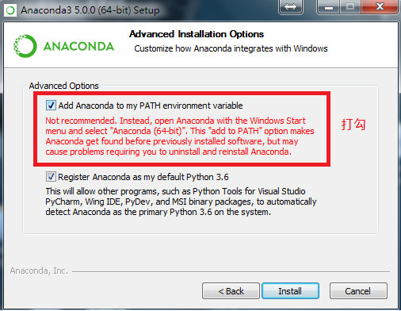
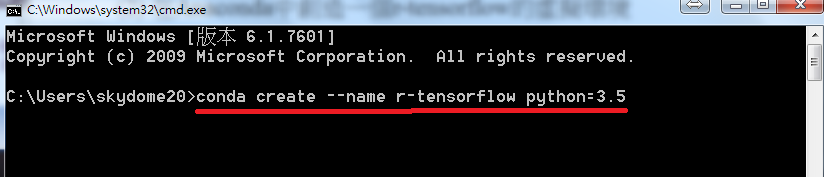
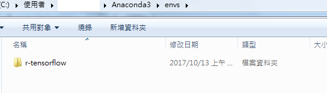
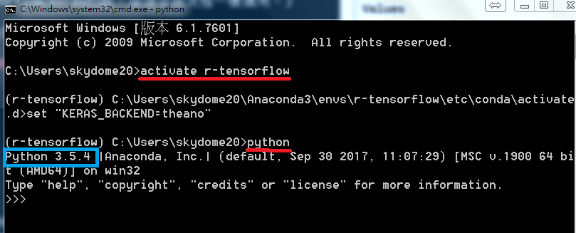

<a href="https://rpubs.com/skydome20/Table" target="_blank">返回主目錄</a>   

------

# 本篇目錄

0. [前言](#P0)
1. [安裝Python版本的Tensorflow/Keras(運行深度學習模型的框架)](#P1)
    * [安裝Anaconda](#P1-1)
    * [在Anaconda下建立r-tensorflow的虛擬環境](#P1-2)
    * [在r-tensorflow環境內，用pip安裝tensorflow/keras](#P1-3)
    * [測試python的tensorflow是否能夠使用](#P1-4)
2. [安裝**R版本**的Tensorflow/Keras的(建立R跟Python之間的介面)](#P2)
    * [用R安裝Github上的rstudio/keras或rstudio/tensorflow](#P2-1)
    * [測試能否在R內使用tensorflow/keras](#P2-2)
3. [Q&A](#P3)
4. [總結](#P4)

---

[Pytorch]:http://pytorch.org/tutorials/
[Tensorflow]:https://www.tensorflow.org/
[Theano]:http://deeplearning.net/software/theano/
[Keras]:https://keras.io/
[Mxnet]:https://mxnet.incubator.apache.org/
[Caffe]:http://caffe.berkeleyvision.org/
[Torch]:http://torch.ch/
[Anaconda]:https://anaconda.org/

<a href="http://rpubs.com/skydome20/Table" target="_blank">【R系列筆記】</a>  

------

##0.前言{#P0}

目前主流的深度學習套件(框架/Framework）有：[Tensorflow], [Theano], [Mxnet], [Torch], [Caffe], [Keras]...

其中，[Tensorflow]是Google在2015年釋出的深度學習開源套件(低階框架)。另一方面，[Keras]屬於比較高階的框架，可以去呼叫比較低階的[Tensorflow]或[Theano]。

(如果擅寫Python的人，現在都會比較推崇[Pytorch]，不過那是後話了)

以程式語言來比喻的話：Keras之於Tensorflow(高階框架vs低階框架)，就如同Python之於C(高階語言vs低階語言)

一開始官方釋出Tensorflow/Keras的時候，主要的程式語言是Python。不過現在多虧Rstudio官方的貢獻，我們也能夠使用R的版本了：

* [rstudio/tensorflow](https://github.com/rstudio/tensorflow)
* [rstudio/keras](https://github.com/rstudio/keras)

如果有曾試著想要在安裝**Tensorflow/Keras**(R版本)的朋友，應該會看一堆安裝教學，並且遇到不少問題(尤其是在windows環境底下)

網路上有不少安裝教學，但幾乎都是零散的資訊：有省略一堆前置作業的，有用linux的概念在講windows的安裝，有沒去考慮使用R的人不一定會使用python...

總之，在走了不少冤枉路後，本文試著結合整理出最簡單且最完整的安裝流程。希望能夠讓想要使用keras這個深度學習套件的R使用者(尤其是windows)，能夠最快解決安裝的問題。

那麼，我們就開始吧，依序會有兩個主要步驟：

------

## 1. Python版本的安裝作業{#P1}

首先，雖說被稱為R的版本，但[Tensorflow]/[Keras]的設計和本質還是基於Python。

所以概念上來說，我們是要「**使用R語言去操作Python版本的Tensorflow/Keras**」。

換句話說，R的套件主要建立一個操作介面，讓我們可以用R語言來建立深度學習的模型，而深度學習模型真正的運行，還是會在Python的tensorflow/keras框架底下。

總之，我們要先安裝Python的[Tensorflow]/[Keras]框架！

在[官方的安裝教學](https://www.tensorflow.org/install/install_windows) 裡，建議我們使用[Anaconda]這個安裝包，創造一個Python的環境。

對於想在windows環境下寫python的人來說，[Anaconda]安裝包十分強大，很多設定上的細節都會自動幫你處理好。在使用上，我認為方便程度跟linux系統不相上下。

------


### (1) 安裝Anaconda {#P1-1}

[這是載點](https://www.anaconda.com/download/)

過程中，請在這一步驟時打勾，這樣可以節省之後去環境變數設定python/pip指令的時間。

(當然，你若熟悉如何設定windows的環境變數指向python的檔案，也可以之後再自行設定)

<center></center>  

<br></br>

安裝完成之後，你的資料夾會長這個樣子(預設路徑：`C:Users\yourname\Anaconda3`) 
 
<center></center> 

<br></br>

(參考：https://www.tensorflow.org/install/install_windows )

------


### (2) 在Anaconda中創造一個r-tensorflow的虛擬環境 {#P1-2}

接下來打開終端機(cmd)，輸入以下指令：

```{r, eval=FALSE}
C:\> conda create --name r-tensorflow python=3.5
```

<center></center>

<br></br>

這個指令是創造一個名為r-tensorflow的虛擬環境，並在裡面安裝python的3.5版本(**目前tensorflow只支援到最新的3.5版本**)。

這個環境就是一個資料夾，可以在路徑：`C:Users\yourname\Anaconda3\envs`的資料夾內中看到：

<center></center> 

<br></br>

要注意的是，資料夾一定要叫**r-tensorflow**。


因為等一下在呼叫R的套件時 (`library(keras)`) ，Rstudio會自動去路徑：`C:Users\yourname\Anaconda3\envs`的資料夾中，尋找名為r-tensorflow的資料夾，抓裡面的python版本、tensorflow、keras...來使用。

(參考：https://github.com/rstudio/keras/issues/147#issuecomment-335990686)

------

### (3) 在r-tensorflow的環境裡，安裝tensorflow/keras {#P1-3}

一樣在終端機(cmd)下，依序輸入以下指令：

1. **進入r-tensorflow的環境中**

2. **安裝tensorflow**

3. **安裝keras**

```{r, eval=FALSE}
C:\> activate r-tensorflow 
(r-tensorflow) C:\> pip install --ignore-installed --upgrade tensorflow 
(r-tensorflow) C:\> conda install -c conda-forge keras
```
<br></br>

以上是安裝tensorflow的cpu版本，若要安裝gpu版本，就把第二個指令改成這樣：
```{r, eval=FALSE}
>(r-tensorflow) C:> pip install --ignore-installed --upgrade tensorflow-gpu
```
<br></br>


(題外話)

若是在安裝tensorflow的過程中，出現以下類似的錯誤訊息，這個問題主要是html5lib的版本老舊，裡面可能有些問題：

```
    Exception:
Traceback (most recent call last):
  File "C:\Users\csprock\Anaconda3\lib\site-packages\pip\basecommand.py", line 215, in main

  File "C:\Users\csprock\Anaconda3\lib\site-packages\pip\req\req_set.py", line 428, in _check_skip_installed
    req_to_install, upgrade_allowed)
  File "C:\Users\csprock\Anaconda3\lib\site-packages\pip\index.py", line 
    inst = cls(resp.content, resp.url, resp.headers)
  File "C:\Users\csprock\Anaconda3\lib\site-packages\pip\index.py", line 731, in __init__
    namespaceHTMLElements=False,
TypeError: parse() got an unexpected keyword argument 'transport_encoding'
```
<br></br>

經過調查後，最好的解法是：

1. 去 https://github.com/html5lib/html5lib-python/tree/master/html5lib 下載新的html5lib檔案

2. 然後把`.\Anaconda3\envs\r-tensorflow\Lib\site-packages\html5lib`給全部複寫

3. 重跑第二、第三個指令，這樣應該就沒問題了！


(參考：https://github.com/rstudio/keras/issues/147#issuecomment-335990686)

(參考：https://stackoverflow.com/questions/46499808/pip-throws-typeerror-parse-got-an-unexpected-keyword-argument-transport-enco)


------

### (4) 測試安裝成功與否 {#P1-4}

安裝結束以後，你就可以使用python版本的tensorflow/keras了！(換句話說，之後有機會要用Python去操作tensorflow/keras的話，這個安裝流程一樣適用。)

要測試是否成功安裝，一樣先在終端機輸入以下指令：

1. **進入r-tensorflow的環境中**

2. **開啟python模式**

```{r, eval=FALSE}
C:\> activate r-tensorflow 
(r-tensorflow) C:\> python
```

畫面會像這樣，紅色部分是指令，藍色則是確認python的版本是3.5沒錯

<center></center> 

<br></br>

然後在python模式底下，輸入以下測試程式碼：

```{python, eval=FALSE}
# Python codes for tensorflow
>>> import tensorflow as tf
>>> hello = tf.constant('Hello, TensorFlow!')
>>> sess = tf.Session()
>>> print(sess.run(hello))

```

成功的話，結果會像這個樣子：

<center></center> 

<br></br>


(參考：https://stackoverflow.com/questions/46499808/pip-throws-typeerror-parse-got-an-unexpected-keyword-argument-transport-enco )


------

## 2. R版本的安裝作業   {#P2}

建立好python的框架後，我們就可以開始安裝R的套件。

R的套件主要是協助建立一個介面，讓我們可以用R語言，去連結Python的框架。

------

### (1) 安裝rstudio/keras或rstudio/tensorflow {#P2-1}

打開RStudio，先安裝Rtools (https://cran.r-project.org/bin/windows/Rtools/)，並且輸入以下指令：

```{r, eval=F}
# installing 'devtools' package for installing Packages from github
install.packages('devtools')

# install tensorflow(如果你要tensorflow的話)
devtools::install_github("rstudio/tensorflow") 

# installing keras(如果你要keras的話)
devtools::install_github("rstudio/keras") 
```

------

### (2) 匯入套件並測試 {#P2-2}


然後就使用`library/require`函式匯入tensorflow/keras(我這裡用keras舉例)：
如果一切都順利的話，跑以下程式碼(任一)應該都不會有問題：

```{r, warning=FALSE, cache=TRUE, message=FALSE}
# Test Tensorflow: Say hello
require(tensorflow)
sess = tf$Session()
hello <- tf$constant('Hello, TensorFlow!')
sess$run(hello)
```

```{r, warning=FALSE, cache=TRUE, message=FALSE}
# Test Keras: Define a simple DNN network
require(keras)
model <- keras_model_sequential() 
model %>% 
  layer_dense(units = 256, activation = "relu", input_shape = c(784)) %>% 
  layer_dropout(rate = 0.4) %>% 
  layer_dense(units = 128, activation = "relu") %>%
  layer_dropout(rate = 0.3) %>%
  layer_dense(units = 10, activation = "softmax")

summary(model)
```

以上這樣就大功告成了！

------

最後，這是我的電腦狀態跟套件版本：
```{r}
sessionInfo()
packageVersion("tensorflow")
packageVersion("keras")
```


------


#**Q&A** {#P3}

網路上有很多安裝教學跟流程，我大致都試過，經過一次次遇到問題，再一次次修正，最後整理這篇筆記。

在過程中，我根據遇到的問題而做了一些選擇跟取捨。我認為將其整理出來並附上心得，會比較好一點：

<br></br>

1. 為何不使用[**tensorflow**](https://github.com/rstudio/tensorflow)、[**keras**](https://github.com/rstudio/keras)內建的`install_tensorflow()`、`install_keras()`？

```
這兩個函式的作用，是會在Anaconda內建立一個r-tensorflow的虛擬環境(如上文1-(2)步驟)，並且自動在裡面安裝python的tensorflow/keras(如上文1-(3)步驟)

可是我在使用的時候，發現都會遇到html5lib的版本老舊的問題，導致tensorflow安裝失敗。這時候還是得手動更新html5lib的檔案，並且在終端機上重複1-(3)的步驟。(令人費解的是，有時候即使更新了還是會安裝失敗)

因此，我認為從頭到尾都在終端機上操作，直接手動在Anaconda內建立r-tensorflow的虛擬環境、並且手動安裝tensorflow/keras，最為穩定且妥當。

```

<br></br>

2. 在R語言中目前有兩個版本：[**keras**](https://github.com/rstudio/keras)跟[**kerasR**](https://github.com/statsmaths/kerasR)，為何選擇[**keras**](https://github.com/rstudio/keras)，而非[**kerasR**](https://github.com/statsmaths/kerasR)？

```
先說說這兩者的區別：keras是Rstudio所開發的介面，而kerasR是statsmaths大神開發的套件。只要點上面的超連結，就可以連到各自的github頁面。

事實上，這兩個套件都是連結python的keras，寫法上十分相近，運行上也沒有太大差別。網路上有不少關於kerasR的教學文章，算是頗為熱門的套件之一。(參考：https://medium.com/towards-data-science/keras-deep-learning-in-r-b0be9dc726ff)

但我之所以不用kerasR，是在使用時遇到一個問題，如這篇討論串所說：https://github.com/statsmaths/kerasR/issues/13

簡單說，在tensorflow的參數設定上(例如：mod$add(Dense(units = 50, input_shape = 13)))，要求數字都得是int的型態，而一般在python這樣寫是沒什麼問題的。

可是當用kerasR的時候，這個寫法：mod$add(Dense(units = 50, input_shape = 13))，裡面的數字卻會被當成float型態，然後傳給python內的tensorflow，導致錯誤訊息。

雖然statsmaths大神在討論串內提到，dev version 0.6.2已經解決這個問題，建議用devtools::install_packages("statsmaths/kerasR")下載github上的版本；可是我照做後，還是出現這個問題。(2017/10/16)

總之在這上面耗得時間太多，這一切太麻煩了，所以就用另一個Rstudio開發的keras，反正模型是一模一樣的XD

```


------

#**總結**  {#P4}

恭喜你，現在已經可以開始在R上面訓練自己的深度學習模型了，幾篇教學文章提供如下：

* https://www.analyticsvidhya.com/blog/2017/06/getting-started-with-deep-learning-using-keras-in-r/

* https://medium.com/towards-data-science/how-to-implement-deep-learning-in-r-using-keras-and-tensorflow-82d135ae4889

* https://medium.com/towards-data-science/keras-deep-learning-in-r-b0be9dc726ff


之後有時間的話，我也會更新自己用keras訓練深度學習模型的筆記(前提是**有時間的話**XD)

It's still a long way to go~   


------   

