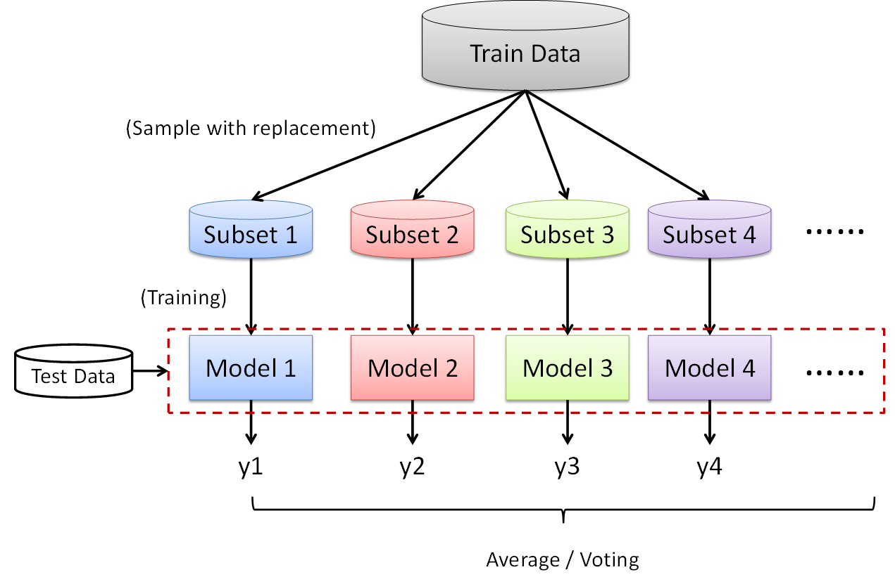
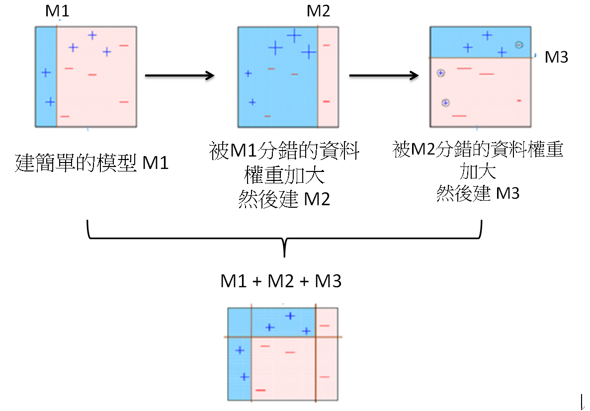
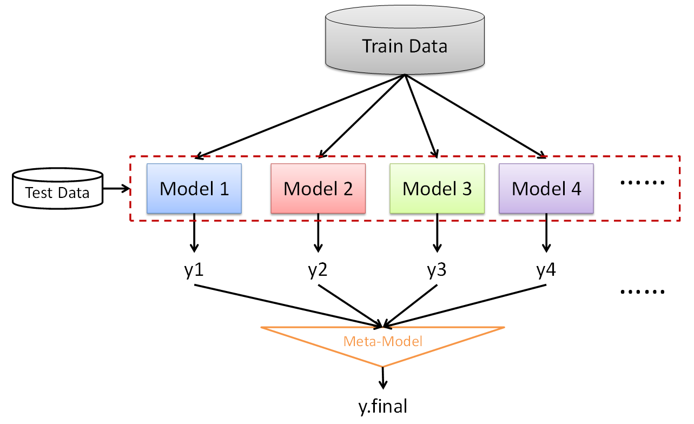
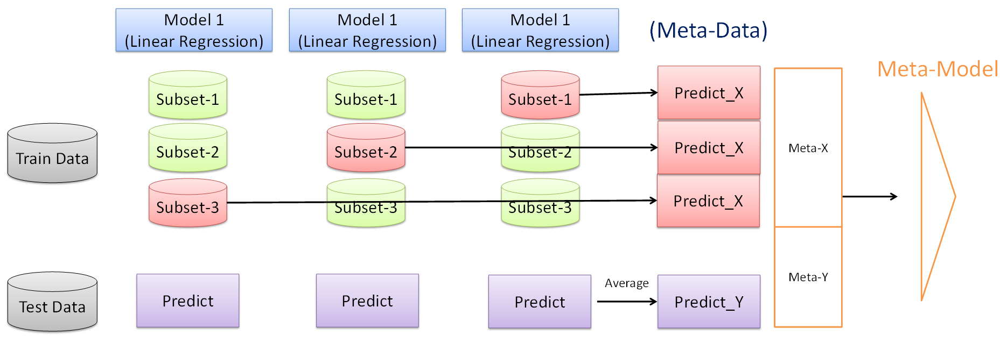
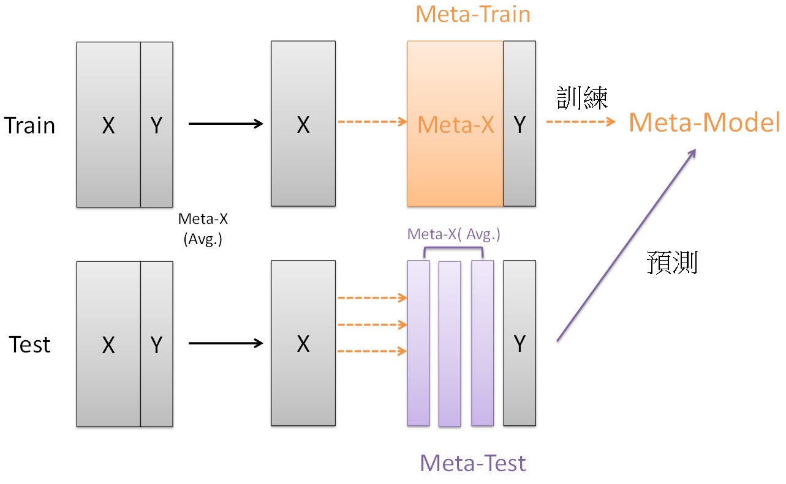

<a href="https://rpubs.com/skydome20/Table" target="_blank">返回主目錄</a>   


------

# 本篇目錄

0. [簡言](#P0)
    * [資料](#P0-1)
1. [Bagging](#P1)
    * [R Code for Bagging Implement](#P1-1)
    * [Random Forest](#P1-2)
2. [Boosting](#P2)
    * [Gradient Boosting Machine(XGboost)](#P2-1)
3. [Stacking](#P3)
    * [R Code for Stacking Implement](#P3-1)
        * [第一階段(Stacking)](#P3-1-1)
        * [第二階段(Meta-Model)](#P3-1-2)
4. [總結](#P4)
5. [Reference](#P5)
6. [R and packages version](#P6)   

------


## 0. 簡言{#P0}   


近幾年來，Ensemble Learning(集成學習)幾乎是火熱地襲捲而來。

無論是在 Kaggle 上的各種競賽、或是全世界(包括台灣)各企業舉辦的比賽，只要是牽扯到「預測」或「分類」的問題，在不考慮變數解釋的狀況下，如果不套入 Ensemble Learning 的技巧，就無法獲得很好的名次。

例如，現在 Kaggle 上世界排名第一的 <a href="https://www.kaggle.com/titericz" target="_blank">Giba </a>，就曾在 2015 年由 Otto 舉辦的比賽中，使用了 38 個模型，搭配 Feature Engineering 以及 Stacking 的技巧，建立三層(*1st level:* 33 models; *2nd level:* *3rd level:* composed weights) 的預測架構，並獲得第一名，相當精彩且值得參考：<a href="https://www.kaggle.com/c/otto-group-product-classification-challenge/discussion/14335" target="_blank">1st PLACE - WINNER SOLUTION - Gilberto Titericz & Stanislav Semenov </a>

此外，由美國最大問答論壇 Quora 舉辦的問題配對比賽中，當時第一名的 <a href="https://www.kaggle.com/colonelcarotte" target="_blank">Maximilien@DAMI </a>
也分享他的建模心得：在使用一般經典的類神經網路下，結合 Stacking 的技巧，建構出四層的文字比對架構：<a href="http://bangqu.com/12Ks1D.html" target="_blank">Quora Question Pairs 競賽冠軍經驗分享：採用 4 層堆疊，經典模型比較給力 </a>

所謂的 Ensemble Learning ，其實就是「三個臭皮匠，勝過一個諸葛亮」的概念，希望藉由團隊合作，結合多種模型的表現，提升最後的預測/分類結果。一般有三種常見的架構：

* Bagging (Bootstrap aggregating)

* Boosting

* Stacking (i.e., meta ensembling; 上述兩個案例都是使用 Stacking 的技巧)

只不過這三種架構，在結合模型時使用的概念並不一樣，因此本文中會依序介紹這三種方法的概念與實踐方式(用 R)，並示範基於此概念而衍生出來的模型程式如何撰寫： Random Forest(隨機森林) 跟 Gradient Boosting Machine(梯度推進器)


------


### 資料{#P0-1}   

以下會拿套件`lasso2`中的前列腺癌症資料用來建模。(關於資料欄位的詳細描述，可以參考<a href="https://rafalab.github.io/pages/649/prostate.html"target="_blank">官方文件</a>)

要注意的是，依變數會是`lpsa`(**Log Prostate Specific Antigen**)，其中 PSA 叫做「攝護腺特異抗原」，代表血漿內的攝護腺特異抗原濃度，當其上升時，是提示攝護腺癌的敏感監測指標之一(但不能作為確診指標)。而其他的變數則作為自變數。

```{r}
data(Prostate, package="lasso2")
str(Prostate)

# 先把資料區分成 train=0.8, test=0.2 
set.seed(22)
train.index <- sample(x=1:nrow(Prostate), size=ceiling(0.8*nrow(Prostate) ))

train = Prostate[train.index, ]
test = Prostate[-train.index, ]
```


------

## 1. Bagging{#P1}   

Bootstrap aggregating (Bagging)，從字面上來看，就是將資料裝成一個袋子一個袋子(Bag)，然後將每個袋子的結果結合在一起。

演算法上，是將樣本重複抽樣(取後放回)，產生多個子資料集(Subsets)後，依序建立多個模型，最後再將所有模型的結果彙整在一起。如果是預測問題(Regression Problem)，那就把所有結果平均起來(Average)；如果是分類問題(Classification Problem)，那就用投票法(Voting)，判斷哪個類別出現最多次。如下圖所示：

</img>


在模型 Bias 跟 Variance 的議題上，Bagging 的手法有助於**降低 variance**。

當每個子集資料在建模的時候，每個模型若獨自拿出來看，會發現都是一個「強模型」(較複雜的模型)，具有低 bias 跟高 variance 的特性；而如今，我們把不同高 variance 的模型結合在一起後，因為是平均(投票)的概念，其結果就會趨近於整體的平均表現，因此 variance 就不會太大。(<a href="https://www.zhihu.com/question/26760839" target="_blank">为什么说bagging是减少variance，而boosting是减少bias?</a>)


-----

### R Code for Bagging Implement{#P1-1}   

Bagging 的一開始，是要先把資料做重複抽樣，因此先將 Train 分成三個子資料集(n=33)：

```{r}
# Subset-1
set.seed(1)
ind_1 = sample(1:nrow(train), 33)
subset_1 = train[ind_1, ]

# Subset-1
set.seed(2)
ind_2 = sample(1:nrow(train), 33)
subset_2 = train[ind_2, ]

# Subset-3
set.seed(3)
ind_3 = sample(1:nrow(train), 33)
subset_3 = train[ind_3, ]
```

對`subset_1`，`subset_2`，`subset_3`分別建立線性迴歸模型，再將 Test 的預測結果平均起來：

```{r, message=FALSE, results='hide', warning=FALSE}
# Model-1 : linear regression
model_1 = lm(lpsa~., subset_1)
y1 = predict(model_1, test)
  
# Model-2 : linear regression
model_2 = lm(lpsa~., subset_2)
y2 = predict(model_2, test)

# Model-3 : linear regression
model_3 = lm(lpsa~., subset_3)
y3 = predict(model_3, test)

# Average Prediction Results
ave_y = (y1+y2+y3)/3

```

由於`lpsa`是連續值，因此使用 MSE 來比較原本模型與 Bagging 後的表現好壞。

可以發現到，`y2`的預測結果是最好的，而`ave_y`的結果是第二好的。原因是因為一開始我們進行了抽樣，這時`subset_2`剛好抽到符合線性迴歸的資料，因此TEST 的 MSE 會最小。然而，如果跟`y1`和`y3`做比較的話，會發現`ave_y`效果較好。


```{r}
# MSE Comparision between three models and the bagging model
c(mean((y1 - test$lpsa)^2),   # linear regression of subset_1
  mean((y2 - test$lpsa)^2),   # linear regression of subset_2
  mean((y3 - test$lpsa)^2),   # linear regression of subset_3
  mean((ave_y - test$lpsa)^2))  # bagging model
```

這就是 Bagging 的概念：用抽樣資料建構的模型，會有好有壞，因此取平均(或投票法)來獲得較穩定(lower variance)的平均表現。


除此之外，在使用 Bagging 時其實並不會只用三個模型這麼少。像是引入 Bagging 概念的演算法「隨機森林」(Random Forest)，往往會建立多達百棵以上的決策樹，然後做平均。

下面小節將會簡介如何用 R 建立隨機森林的模型。

-----

### Random Forest{#P1-2}   

所謂的隨機森林，就是運用 Bagging + CART決策樹，也就是說`Model-1 ~ Model-n`全都都是用決策樹來建模，而這麼多棵的樹組合在一起，所以才稱為「森林」。

要注意的是，隨機森林在抽樣過程中，不只是對 Row 進行抽樣，同時也會對 Column 抽樣，因此產生的子集資料，其實是對欄跟列抽樣後的結果。之後再針對這些子集資料，各自訓練一棵決策樹，形成隨機森林。

事實上，在面對資料中有共線性(collinearity)跟類別不平衡(Class Imbalance Problem)，而這些問題會對預測結果造成不良影響時(若是探討對「變數解釋性」的影響，則需要用 Lasso 或 Stepwise 來解決)，隨機森林是倍受青睞的演算法。其概念應該不難理解：「對 Row 抽樣時，可以部份解決類別不平衡來影響預測的問題；對 Column 抽樣時，可以部份解決共線性來影響預測的問題」

而在 R 裡面，`randomForest`套件可以幫我們建立隨機森林的模型：

```{r, message=FALSE, warning=FALSE}
require(randomForest)

rf_model = randomForest(lpsa~.,
                        data=train,
                        ntree=150        # 決策樹的數量
                        )
# 預測
rf_y = predict(rf_model, test)
mean((rf_y - test$lpsa)^2) # MSE
```

這裡有一個建模中都會遇到的重要議題：「要決定多少決策樹？」(也就是`ntree`要設定多少？)

方法很簡單：「觀察每增加一棵樹的話，整體的誤差如何改變」。而要決定隨機森林的最佳棵樹，只要把`randomForest()`的物件給畫出來就好。

根據下圖，我們可以知道，當`ntree = 70`之後，整體的誤差大概就趨於穩定。因此其實並不需要 150 棵決策樹這麼多，使用 70~80 棵就可以了。

```{r}
# Observe that what is the best number of trees
plot(rf_model)
```

在決定好`ntree`的數量後，另一個參數`mtry`其實也需要去 Tune，這個參數代表每次抽樣時需要抽「多少個變數」的意思。

我們可以使用`tuneRF()`來 tune `mtry`的值，並根據下面的結果與圖，得知每次抽樣時「抽4個變數」會是比較好的選擇：

```{r}
tuneRF(train[,-9], train[,9])
```

因此，本來的隨機森林模型，在最佳化的參數後可以重寫成這樣(可以回去跟一開始的模型結果比對，MSE 的確變得更小了)：

```{r}
rf_model = randomForest(lpsa~.,
                        data = train,
                        ntree = 70,        # 決策樹的數量
                        mtry = 4
                        )
# 預測
rf_y = predict(rf_model, test)
mean((rf_y - test$lpsa)^2) # MSE
```


除此之外，我們也可以觀察在隨機森林的模型中，有哪些變數是會對損失函數(Loss Function)最有貢獻的；換句話說，也就是「變數挑選」的概念(非線性模型的變數挑選)：

```{r}
# Variable Importance of Random Forest
rf_model$importance
varImpPlot(rf_model)
```

(變數挑選的結果可以跟 <a href="http://rpubs.com/skydome20/R-Note18-Subsets_Shrinkage_Methods" target="_blank">R筆記-(18)</a> 比對，會發現跟 Stepwise 和 Lasso 挑出來的變數一樣哦！)


-----

## 2. Boosting{#P2}   

跟 Bagging 使用多個「強模型」不同， Boosting 會強調使用上需要多個「弱模型」才可以。

其概念用「三個臭皮匠，勝過一個諸葛亮」來形容最為貼切，也就是需要有多個非常弱的「臭皮匠」，而這些臭皮匠彼此是互補的。也就是說： M2 模型要能辦到 M1 模型所辦不到的， M3 要辦到 M2 所辦不到的......。

會強調要「弱模型」，是因為模型本身如果「有點強」還不行。以最簡單的說法來說明：當模型都「有點強」時，彼此就會開始打架，造成有意見不合的狀況(這在人類社會中很常遇見吧XD)。

以人類分工合作的概念來說，如果每個人只會一項技能，那只要好好專司自己的職責，便不會去插手其他人的事務；但如果今天大家都是碩士博士，那對於某個問題，便會有許多人都給意見，有時候反而會造成干擾。

模型也是這樣的，今天 M1 M2 M3 如果太複雜(太強)，那彼此之間就會互相干擾，影響最後預測/分類結果；唯有彼此都是「弱模型」，才能好好專注在自己本身的預測/分類，然後再把彼此的成果結合一起，這就是 Boosting 的概念。(當然以計算效率的考量，這樣做也比較快)(<a href="https://stats.stackexchange.com/questions/23388/in-boosting-why-are-the-learners-weak" target="_blank">In boosting, why are the learners “weak”?</a>)


在演算法中，要從資料中找 M1 M2 M3...的模型是有順序的，概念跟 Bagging完全不一樣：

* 在 Bagging 時，我們是將資料做抽樣，因此獲得許多子集資料，並各別建模後，把結果平均/投票。

* 在 Boosting 時，一開始先建一個簡單的模型 M1 ，此時會有預測錯誤的資料，把這些資料的權重加大，建 M2 模型，然後又會有預測錯的資料，再把資料的權重加大，建 M3 模型...

演算法的概念如下圖所示：


</img>


在模型 Bias 跟 Variance 的議題上，Boosting 的手法有助於**降低 bias**。

由於使用上是拿「弱模型」來用，這些弱模型其實是高 bias 跟 低 variance 的，並且每次迭代的時候，都會基於先前的模型上進行優化(用梯度下降法，決定這次模型建在哪裡能使損失函數下降最多)。既然是降低損失函數，表示過程中會越來越逼近實際值，換句話說，就是逐漸**降低 bias **的意思。(<a href="https://www.zhihu.com/question/26760839" target="_blank">为什么说bagging是减少variance，而boosting是减少bias?</a>)


(由於使用的資料並非分類問題，因此難以用本資料進行 Boosting 的模擬實踐。接下來會介紹以 Boosting 為基準發展出的演算法，Gradient Boosting Machine。)

-----

### Gradient Boosting Machine(XGboost){#P2-1}   

所謂的 GBM 算是一種概念，是將梯度下降法(Gradient Descending)跟 Boosting 套件節合在一起的演算法，而後面的 Machine 指不特定的模型，只要能用梯度下降法找尋方向的模型都可以。

目前市面上，如果使用 gbm 的套件，基本上都是 Tree-based 為主，也就是將數百個弱決策樹(CART)，跟梯度下降法和 Boosting 結合在一起。

而 XGboost 又有些許不同，是本來的 Gradient Boosting Decision Tree(GBDT)的改良版本，細節處可以參考這篇文章：<a href="https://www.zhihu.com/question/41354392" target="_blank">机器学习算法中GBDT和XGBOOST的区别有哪些？</a>。

如果有在關注 Kaggle 的人，就會知道近年來 XGboost 被譽為是「Kaggle 神器」。原因無他，就是因為每年的得名隊伍，使用 XGboost 的團隊基幾乎大多數！(更多關於 XGboost 的介紹可以參考這篇：<a href="xgboost: 速度快效果好的 boosting 模型" target="_blank">机器学习算法中GBDT和XGBOOST的区别有哪些？</a>)

在 R 裡面，使用的是套件`xgboost`。

我在使用 xgboost 會用下面這樣的SOP，提供當作參考：

1. 將資料格式(Data.frame)，用`xgb.DMatrix()`轉換為 xgboost 的稀疏矩陣

2. 設定`xgb.params`，也就是 xgboost 裡面的參數

3. 使用`xgb.cv()`，tune 出最佳的決策樹數量(`nrounds`)

4. 用`xgb.train()`建立模型


```{r, warning=FALSE, message=FALSE}
# 1. 將資料格式(Data.frame)，用`xgb.DMatrix()`轉換為 xgboost 的稀疏矩
require(xgboost)

dtrain = xgb.DMatrix(data = as.matrix(train[,1:8]),
                     label = train$lpsa)
dtest = xgb.DMatrix(data = as.matrix(test[,1:8]),
                     label = test$lpsa)

```

轉換完資料後，便是 xgboost 的參數設定。

這裡我用註解盡量描述每個參數的詳細意義(想知道如何設定，請參閱 <a href="https://github.com/dmlc/xgboost/blob/master/doc/parameter.md" target="_blank">Github上的 Xgboost parameters</a> )：


```{r}
# 2. 設定xgb.params，也就是 xgboost 裡面的參數

xgb.params = list(
  #col的抽樣比例，越高表示每棵樹使用的col越多，會增加每棵小樹的複雜度
  colsample_bytree = 0.5,                    
  # row的抽樣比例，越高表示每棵樹使用的col越多，會增加每棵小樹的複雜度
  subsample = 0.5,                      
  booster = "gbtree",
  # 樹的最大深度，越高表示模型可以長得越深，模型複雜度越高
  max_depth = 2,           
  # boosting會增加被分錯的資料權重，而此參數是讓權重不會增加的那麼快，因此越大會讓模型愈保守
  eta = 0.03,
  # 或用'mae'也可以
  eval_metric = "rmse",                      
  objective = "reg:linear",
  # 越大，模型會越保守，相對的模型複雜度比較低
  gamma = 0)               

```

接著，就使用`xgb.cv()`的函式，搭配 cross validation 的技巧，找出最佳的決策樹數量`nrounds`。

`xgb.cv()`這個函式，主要是在 tune 樹的最佳的棵樹(nrounds)，所以說模型訓練的時候是這樣的：

當nround=1，表示現在訓練「只有一棵樹」的模型。資料會分成5等份(因為是做5-fold cv)。這時，把第一等份的資料當作 Validation，剩下當作Train，訓練一次模型，得到Train 跟 Validation 的預測表現；接著，把第一等份的資料當作 Validation，剩下當作 Train，訓練一次模型，得到 Train 跟 Validation 的預測表現。
 
 
以上做法重複 5 次，再取平均跟取 stand deviation，就會是 nround=1 時的模型平均表現；nrounds=2 時，重複上面的動作。
 
過程中，程式會根據 Train 和 Validation 的平均表現，自動判斷模型是否有  overfitting，最後找出較好的 nrounds，會是一個最不 overfitting 的模型。


要注意的是，這個最不 overfitting 的模型，是建立在一開始的基本參數設定之下，所以不一定是最好的。如果發生某些情況，就得回去調 xgb.params，才有機會獲得更好的模型。

(上面敘述我用的是 Validation 這個字， 但 `cv.xgb()`產出的報表中會是 Test 這個字)
 
```{r}
# 3. 使用xgb.cv()，tune 出最佳的決策樹數量
cv.model = xgb.cv(
  params = xgb.params, 
  data = dtrain,
  nfold = 5,     # 5-fold cv
  nrounds=200,   # 測試1-100，各個樹總數下的模型
  # 如果當nrounds < 30 時，就已經有overfitting情況發生，那表示不用繼續tune下去了，可以提早停止                
  early_stopping_rounds = 30, 
  print_every_n = 20 # 每20個單位才顯示一次結果，
) 


```

我們可以畫圖，觀察 CV 過程中Train 跟 Validation 資料的表現(紅色：Train，藍色：Validation)：


```{r}
tmp = cv.model$evaluation_log

plot(x=1:nrow(tmp), y= tmp$train_rmse_mean, col='red', xlab="nround", ylab="rmse", main="Avg.Performance in CV") 
points(x=1:nrow(tmp), y= tmp$test_rmse_mean, col='blue') 
legend("topright", pch=1, col = c("red", "blue"), 
       legend = c("Train", "Validation") )


```

一般來說，Train 的表現會比 Validation 還要好，這時有兩種情況要思考：

1. 如果 Train 跟 Validation 相近，表示模型其實還可以訓練得更好(更複雜)，藉由提高 Train 的表現，觀察 Validation 是否有機會提升，因此可以調以下參數，以**提高模型複雜度**的概念進行：

  * `max_depth` 調高 1 單位 (*最建議調這個*)
    
  * `colsample_bytree`、`subsample`調高比例 (*調這個也不錯*)
    
  * `eta`調低 (*不得以才調這個*)
    
  * `gamma` 調低 (*不得以才調這個*)

2. 如果 Train 比 Validation 好太多，就表示有 ovrfitting的問題發生，這時候上面的參數就要反過來調，以**降低模型複雜度**的概念來進行。
  
再來，就可以利用把`cv.model`中的`best_iteration`取出來，這是 xgboost 內部會自動判斷最好的 `nrounds`是多少，其方法是觀察 Train 跟 Validation 之間的表現差異：

```{r}
# 獲得 best nround
best.nrounds = cv.model$best_iteration 
best.nrounds

# 4. 用xgb.train()建立模型
xgb.model = xgb.train(paras = xgb.params, 
                      data = dtrain,
                      nrounds = best.nrounds) 

# 如果要畫出 xgb 內的所有決策樹，可以用以下函式(但因為會很多，這裡就不畫了)
# xgb.plot.tree(model = xgb.model) 

# 預測
xgb_y = predict(xgb.model, dtest)
mean((xgb_y - test$lpsa)^2) # MSE
```


-----


## 3. Stacking{#P3}


關於 Stacking 的概念，不知道為什麼比較冷門，相較於另外兩個架構在網路上的資源也較少。但有趣的是，近年來獲得冠軍的隊伍，反而都是用 Stacking 的技巧。

其演算法粗略概念如下圖，會有兩個階段：

1. 用 Train 資料訓練多個模型，並且得出預測值(yn)，此時稱作 meta-data，作為第二階段的輸入

2. 拿 meta-data 進一步訓練一個 meta-model，得到最後的預測值。

</img>

簡言之，第一階段其實就是我們平常在訓練模型的步驟，只不過這時預測出來的值會再度重新當作自變數，然後在第二階段進行訓練及預測。

但上面這樣的描述其實很不詳細，得進一步看細節的訓練狀況，才知道 Stacking 的核心概念。下圖以 Model-1 為例，示範訓練過程及如何產出 meta-data ：

</img>


在訓練過程中，會先將 Train 再分成學習(綠色)跟預測(紅色)的資料集(其實就是把 Train 再分成 Train 跟 Validation 的概念(n-folds)，只是後者預測後的值會作為 Meta-X)。

至於 Test，則是會看 Train 分成多少 n-folds，就會有 n 次的預測值，然後再平均後當作 Meta-Y。如下圖所示：

</img>


以上只是單一個模型內部的訓練過程，會產出一組 Meta-Data；如果今天有 4 個模型 (Model-1 ~ Model-4)，那最後就會產出 4 組 Meta-Data，然後丟給第二階段的 Meta-Model 來訓練跟預測(甚至有時候會發展到第三、第四階段，實際的應用已經在[簡言](#P0)中提及了。)

以上，就是 Stacking 的概念，下一小節會用 R 實踐 Stacking 的概念：

-----

### R Code for Stacking Implementg{#P3-1}

#### 第一階段(Stacking){#P3-1-1}
一開始，先把 Train 分成 n-folds (n=3)：

```{r}
# 3-folds
n = 3
n.folds = rep(1:n, each=nrow(train)/n)
train.folds = split(train, n.folds)

```

接著，用 linear regression 為例，撰寫一個 stacking 架構，並且儲存meta-x 跟 meta-y的值：

```{r, eval=TRUE}
meta.x = vector()
meta.y = list()

# 1st fold for validation
stacking.train = rbind(train.folds[[2]], train.folds[[3]])
stacking.valid = train.folds[[1]]
stacking.test = test

model_1 = lm(lpsa~., stacking.train)

tmp.meta.x = predict(model_1, stacking.valid)
tmp.meta.y = predict(model_1, stacking.test)

meta.x = c(meta.x, tmp.meta.x)
meta.y[[1]] = tmp.meta.y

# 2nd fold for validation
stacking.train = rbind(train.folds[[1]], train.folds[[3]])
stacking.valid = train.folds[[2]]
stacking.test = test

model_1 = lm(lpsa~., stacking.train)

tmp.meta.x = predict(model_1, stacking.valid)
tmp.meta.y = predict(model_1, stacking.test)

meta.x = c(meta.x, tmp.meta.x)
meta.y[[2]] = tmp.meta.y

# 3rd fold for validation
stacking.train = rbind(train.folds[[1]], train.folds[[2]])
stacking.valid = train.folds[[3]]
stacking.test = test

model_1 = lm(lpsa~., stacking.train)

tmp.meta.x = predict(model_1, stacking.valid)
tmp.meta.y = predict(model_1, stacking.test)

meta.x = c(meta.x, tmp.meta.x)
meta.y[[3]] = tmp.meta.y

```


所以第一個線性模型跑完三次之後，就會得到一組`meta.x`跟`meta.y`，再跟本來的實際值(`train$lpsa`, `test$lpsa`)結合，成為第一個模型輸出的 `meta.train.1`跟 `meta.test.1`：

```{r}

# Average Meta.X of Test
mean.meta.y = (meta.y[[1]] + meta.y[[2]] + meta.y[[3]]) / 3

meta.train.1 = data.frame(`meta.x` = meta.x, 
                          y=train$lpsa)

meta.test.1 = data.frame(`mete.y` = mean.meta.y, 
                         y = test$lpsa)
```


接下來，第二模型用**support vector regression**，也是一樣的流程：


```{r, message=FALSE, warning=FALSE}
require(e1071)
meta.x = vector()
meta.y = list()

# 1st fold for validation
stacking.train = rbind(train.folds[[2]], train.folds[[3]])
stacking.valid = train.folds[[1]]
stacking.test = test

model_2 = svm(lpsa~., stacking.train)

tmp.meta.x = predict(model_2, stacking.valid)
tmp.meta.y = predict(model_2, stacking.test)

meta.x = c(meta.x, tmp.meta.x)
meta.y[[1]] = tmp.meta.y

# 2nd fold for validation
stacking.train = rbind(train.folds[[1]], train.folds[[3]])
stacking.valid = train.folds[[2]]
stacking.test = test

model_2 = svm(lpsa~., stacking.train)

tmp.meta.x = predict(model_2, stacking.valid)
tmp.meta.y = predict(model_2, stacking.test)

meta.x = c(meta.x, tmp.meta.x)
meta.y[[2]] = tmp.meta.y

# 3rd fold for validation
stacking.train = rbind(train.folds[[1]], train.folds[[2]])
stacking.valid = train.folds[[3]]
stacking.test = test

model_2 = svm(lpsa~., stacking.train)

tmp.meta.x = predict(model_2, stacking.valid)
tmp.meta.y = predict(model_2, stacking.test)

meta.x = c(meta.x, tmp.meta.x)
meta.y[[3]] = tmp.meta.y

# Average Meta.X of Test
mean.meta.y = (meta.y[[1]] + meta.y[[2]] + meta.y[[3]]) / 3

meta.train.2 = data.frame(`meta.x` = meta.x, 
                          y=train$lpsa)

meta.test.2 = data.frame(`mete.y` = mean.meta.y, 
                         y = test$lpsa)

```


仿照上面的流程，第三個模型則用 CART 決策樹：

```{r, message=FALSE, warning=FALSE}
require(rpart)
meta.x = vector()
meta.y = list()

# 1st fold for validation
stacking.train = rbind(train.folds[[2]], train.folds[[3]])
stacking.valid = train.folds[[1]]
stacking.test = test

model_3 = rpart(lpsa~., stacking.train)

tmp.meta.x = predict(model_3, stacking.valid)
tmp.meta.y = predict(model_3, stacking.test)

meta.x = c(meta.x, tmp.meta.x)
meta.y[[1]] = tmp.meta.y

# 2nd fold for validation
stacking.train = rbind(train.folds[[1]], train.folds[[3]])
stacking.valid = train.folds[[2]]
stacking.test = test

model_3 = rpart(lpsa~., stacking.train)

tmp.meta.x = predict(model_3, stacking.valid)
tmp.meta.y = predict(model_3, stacking.test)

meta.x = c(meta.x, tmp.meta.x)
meta.y[[2]] = tmp.meta.y

# 3rd fold for validation
stacking.train = rbind(train.folds[[1]], train.folds[[2]])
stacking.valid = train.folds[[3]]
stacking.test = test

model_3 = rpart(lpsa~., stacking.train)

tmp.meta.x = predict(model_3, stacking.valid)
tmp.meta.y = predict(model_3, stacking.test)

meta.x = c(meta.x, tmp.meta.x)
meta.y[[3]] = tmp.meta.y

# Average Meta.X of Test
mean.meta.y = (meta.y[[1]] + meta.y[[2]] + meta.y[[3]]) / 3

meta.train.3 = data.frame(`meta.x` = meta.x, 
                          y=train$lpsa)

meta.test.3 = data.frame(`mete.y` = mean.meta.y, 
                         y = test$lpsa)
```


-----


#### 第二階段(Meta-Model){#P3-1-2}


所以現在我們手中有三組 Meta-Train 跟 三組 Meta-Test：
```{r}
c(dim(meta.train.1), dim(meta.test.1))
```

所以現在要建構第二階段的 Meta-Data，我這裡拿`xgboost`的模型來做：

```{r}
### Meta- Model Constraction 

# 先把三個 Meta-Train合併一起：
big.meta.train = rbind(meta.train.1, meta.train.2, meta.train.3)

# 轉換成 xgboost 的格式
dtrain = xgb.DMatrix(data = as.matrix(big.meta.train[,1]), label = big.meta.train[, 2])

# 訓練 XGboost 模型
# 其中xgb.params 直接拿第二節(Boosting)的設定
# 簡單用 nrounds = 100
xgb.model = xgb.train(paras = xgb.params, data = dtrain, nrounds = 100) 

# 對三組 Meta-Test進行預測：
dtest.1 = xgb.DMatrix(data = as.matrix(meta.test.1[,1]), label = meta.test.1[, 2])
final_1 = predict(xgb.model, dtest.1)

dtest.2 = xgb.DMatrix(data = as.matrix(meta.test.2[,1]), label = meta.test.2[, 2])
final_2 = predict(xgb.model, dtest.2)

dtest.3 = xgb.DMatrix(data = as.matrix(meta.test.3[,1]), label = meta.test.3[, 2])
final_3 = predict(xgb.model, dtest.3)

# 把三組結果平均起來，然後算 MSE
final_y = (final_1 + final_2 + final_3)/3
mean((final_y - test$lpsa)^2) # MSE
```


------

## 4. 總結{#P4}

關於 Ensemble Learning，其實牽扯的層面相當廣泛，實在很難在短短一篇文章中，便將所有細節及該考量的議題書寫出來，因此只能在本文中提及我認為較重要的地方。

若真的想要好好了解這個技巧，並且知道背後的數學公式以幾何含意，歡迎聆聽<a href="https://www.youtube.com/watch?v=tH9FH1DH5n0" target="_blank">台大李宏毅老師的教學影片(Ensemble)</a> ，講解得非常完整，相當值得好好花一個半小時來學習；或是閱讀南京大学周志华老师的文章* <a href="http://www2.islab.ntua.gr/attachments/article/86/Ensemble%20methods%20-%20Zhou.pdf" target="_blank">Ensemble methods: foundations and algorithms</a>，裡面對各種 Ensemble Models 有很好的詳解，以及優缺點討論。

Ensemble Learning 雖然在預測上的效果很好，是傳統模型無法比擬的。不過當大家都追求「高預測表現」時，或許有時候慢下來是另外一種選擇。

試著重新回到最基本的模型(線性迴歸、決策樹)，並探討資料中變數的深層涵義，思考資料跟現實中如何互相影響、對應，並做出未來的決策方向......或許，這樣才能真正解決存在於現實中的問題(痛點)

It's still a long way to go~  

------

## 5 Reference{#P5}


* <a href="https://www.zhihu.com/question/26760839" target="_blank">为什么说bagging是减少variance，而boosting是减少bias?</a> 

* <a href="https://www.youtube.com/watch?v=tH9FH1DH5n0" target="_blank">李宏毅老師的教學影片(Ensemble)</a>  

* <a href="https://www.zhihu.com/question/41354392" target="_blank">机器学习算法中GBDT和XGBOOST的区别有哪些？</a> 

* <a href="http://blog.csdn.net/willduan1/article/details/73618677" target="_blank">集成学习总结 & Stacking方法详解 </a> 

* <a href="http://violin-tao.blogspot.tw/2018/01/ml-ensemble.html" target="_blank">ML Lecture 27: Ensemble</a>

* <a href="https://www.jiqizhixin.com/articles/2017-08-28-3" target="_blank">从Boosting到Stacking，概览集成学习的方法与性能</a>

* <a href="http://www.cnblogs.com/jasonfreak/p/5720137.html" target="_blank">Random Forest和Gradient Tree Boosting参数详解</a>

* <a href="https://github.com/dmlc/xgboost/blob/master/doc/parameter.md" target="_blank">Github上的 Xgboost parameters</a>

* <a href="https://stats.stackexchange.com/questions/23388/in-boosting-why-are-the-learners-weak" target="_blank">In boosting, why are the learners “weak”?</a>

* <a href="http://www2.islab.ntua.gr/attachments/article/86/Ensemble%20methods%20-%20Zhou.pdf" target="_blank">南京大学周志华老师的Ensemble methods: foundations and algorithms</a>


------

## 6. R and packages version{#P6}

這是本篇筆記使用R跟套件版本：

```{r}
pkgs = c("lasso2", "randomForest", "e1071","xgboost", "rpart")
r_version = paste("R", getRversion())
pkg_version = c()
for (package_name in pkgs) {
    pkg_version = c(pkg_version, 
                    paste(package_name,packageVersion(package_name)))
}
c(r_version, pkg_version)

```

