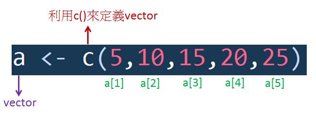
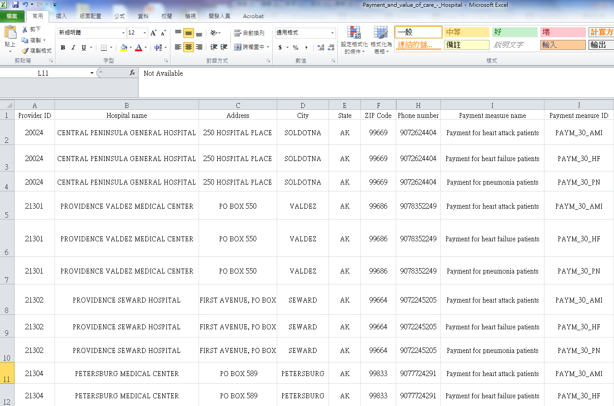
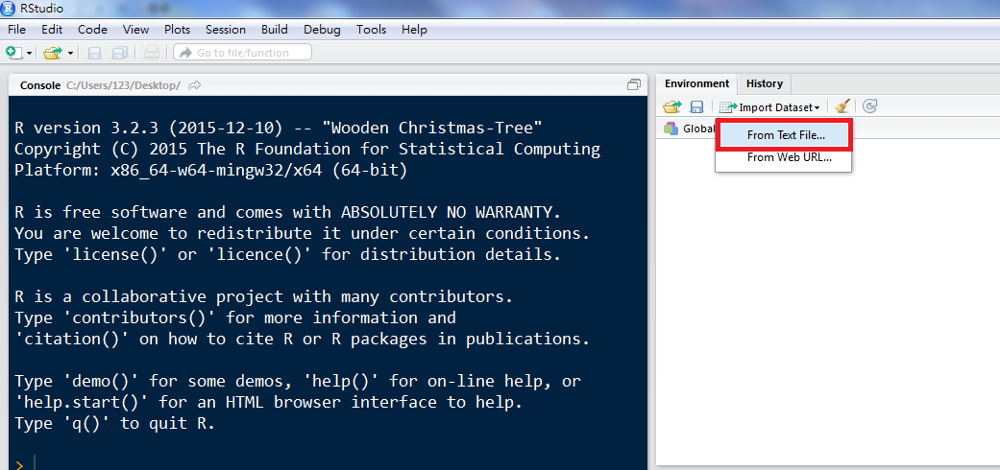

<a href="https://rpubs.com/skydome20/Table" target="_blank">返回主目錄</a>   

------

# 本篇目錄

1. [Integer & Number & Logic & Character](#P1)
    * [數字 (integer, number)](#P1-1)
    * [布林代數 (logic)](#P1-2)
    * [字串 (character)](#P1-3)
2. [Vector & Factor & List](#P2)
    * [陣列 (vector)](#P2-1)
    * [類別變數 (factor)](#P2-2)
    * [列表(list)](#P2-3)    
3. [Matrix & Data Frame](#P3)
    * [矩陣(matrix)](#P3-1)
    * [資料框(data frame)](#P3-2)
4. [總結](#P4)   
5. [(額外)關於賦值](#P5) 
    

------

在<a href="https://rpubs.com/skydome20/R-Note1-R_and_RStudio" target="_blank">安裝完R與RStuio</a>   後，接下來要開始熟悉R的基本觀念。   
要熟悉一個程式語言，第一步就是先了解定義在裡面的資料型態。而在R語言的資料型態，常用的有這些：

* `integer`  
* `number`
* `logic`
* `character`
* `factor`
* `vector`
* `list`
* `matrix`
* `data frame`

看起來很多感覺很複雜，但不用擔心，接下來會一邊用例子、一邊介紹這些型態。

------

#**1. integer，number，logic，character**{#P1}
這四個型態比較簡單：   

* 「整數」的`integer`
* 「實數」的`number`
* 「布林代數」的`logic`
* 「字串」的`character`

##數字 (integer, number) {#P1-1} 

若要在R裡宣告一個數字，可以這麼做：
```{r}
a <- 3     
b <- 1.6   
```

在這裡，我們稱`a`和`b`為「變數」(或是物件)。   
而`<-`符號，會把右邊的東西，儲存到左邊的名字裡，使左邊的名字變成「變數」(如下圖)   
   

當賦值結束後，我們會需要確認變數的資料型態，這時候可以使用`str()`函式：
```{r}
str(a)
```

上面結果顯示，`a`的資料型態是「number」，而非`integer`。有點奇怪，對吧？   
這是因為R預設的數字型態是「number」，意思是，若直接把數字存到變數中，其資料型態是「number」。
那麼，如果想要轉換資料型態，變成`integer`呢？這時候就可以使用`as.integer()`函式：
```{r}
a <- as.integer(3)
str(a)
```

如果，想要轉換成`number`的資料型態呢？
應該猜到了，沒錯，就是使用`as.numeric()`的函示。**(不是`number`，而是`numeric`哦！)**   
更棒的是，這樣的概念可以「舉一反三」！下表就是各種資料型態，所對應的轉換函式： 


| 資料型態   |      轉換函式      |
|:----------:|:------------------:| 
| integer    |  as.integer()      | 
| number     |  as.numeric()      | 
| character  |  as.character()    |    
| factor     |  as.factor()       |  
| matrix     |  as.matrix()       |  
| vector     |  as.vector()       |  
| list       |  as.list()         |  
| data frame |  as.data.frame()   |

有時候，我們要確認變數的資料型態，是否為`integer`，這時可以使用`is.integer()`函式：
```{r, results='hold'}
is.integer(a)
is.integer(b)
```
`str()`的功能是「顯示資料型態」，而`is.integer()`則是「判斷是否為integer，回傳TRUE/FALSE」。   
當然，這時聰明的人就會思考，是不是也可以舉一反三呢？   
答案是，可以的：

| 資料型態   |      判斷函式      |
|:----------:|:------------------:| 
| integer    |  is.integer()      | 
| number     |  is.numeric()      | 
| character  |  is.character()    |    
| factor     |  is.factor()       |  
| matrix     |  is.matrix()       |  
| vector     |  is.vector()       |  
| list       |  is.list()         |  
| data frame |  is.data.frame()   |


##布林代數 (logic){#P1-2} 

所謂的布林代數(boolean)，代表的是`True`和`False`，常用於邏輯式上的判斷。而在R裡面，以`logic`的資料型態來表示：
```{r, results='hold'}
a <- TRUE
b <- FALSE
str(a)        #確認a的型態
is.integer(b) #判斷b是不是整數，但b是logic型態，所以回傳FALSE
```   

##字串 (character){#P1-3}  
要定義一個`character`變數的話，注意放在右邊的值，要用雙引號(`" "`)括起來：
```{r}
professor <- "Dr.Lee"
```   
   
如果沒有括起來，右邊就會視為「變數」。若沒有事先定義的話，就會跳出錯誤訊息：
```{r,error=TRUE}
professor <- Dr.Lee
```   
   
換句話說，只要事先定義好變數，那麼變數之間，就可以互相傳遞自己儲存的值：
```{r}
a <- "Dr.Lee"    # a的資料型態是character
professor <- a   # a是變數，把a存到professor裡
str(professor)   # 確認professor資料型態
```   

------
   
#**2. vector，factor，list**{#P2}   
##陣列 (vector){#P2-1}
R裡面有一個十分重要的資料型態，那就是vector(陣列/向量)！   
我們在資料分析時，常常是針對一張表(table/sheet)進行處理。有時候會需要處理「某一列」(row)，或「某一行」(column)，而這樣長長的一個row/column，在R裡就被儲存成vector的形式。   
要定義一個vector，需要使用`c()`的函式：
```{r, results='hold'}
a <- c(5,10,15,20,25)           # 建立一個number vector
b <- c("Tom", "Henry", "John")  # 建立一個character vector
a
b
```

在上面，定義一個vector變數叫做a，裡面的數字(1~5)就被稱為元素(element)。   
`vector`的概念其實不難懂，就把它想像成一條長長的火車，每個車廂都存放一個貨品(element)。   
既然是車廂，那就一定有車廂編號，這在`vector`裡面稱為**index**，表示方式為`object[index]`。(如下圖)   
   
(小練習)利用**index**，取出特定的element吧：   
```{r, results='hide'}
a[3]      # Ans: 15           (取第3個element)
a[1:3]    # Ans: 5 10 15      (取第1~第3個element)
a[c(2,4)] # Ans: 10 20        (取第2和第4個element)
```

在vector裡有一個需要注意的規則：「每一個element」都會是相同的型態！
```{r}
a <- c(1, "john", 3) # 若是把number和character同時放入vector裡，
a                    # R會自動將所有element的型態，轉變成character 

b <- c(T, 3, F)      # logic和number在vector裡的話
b                    # T和F會被自動轉換成1和0，變成數字的vector
```

當然，vector之間也可以進行數學運算：
```{r, results='hold'}
a <- c(7,8,6,9,5) # 建立一個number vector
b <- c(2,4,6,0,1) # 建立一個number vector

a * b             # a和b的第一個element相乘，第二個element相乘......
b^3               # 對b之中的每一個element三次方
b > 3             # 判斷b之中的哪些值大於 3 ，然後回傳 TRUE/FALSE
```

##類別變數 (factor){#P2-2}  
`factor`的型態，主要用來表示「類別變數」(category variable)。   
(例如：性別(男、女)，年級(小一、小二....碩一、碩二)，地區(北、中、南、東)...等等。)  
在用R進行資料分析時，當遇到這類「類別變數」時，要轉換成`factor`的資料型態，再丟入模型(model)進行分析。   

`factor`的資料型態和`vector`很相似，差別在於`factor`具有額外的類別屬性(Levels)。   
要建立factor的變數，可以使用`factor()`函式：
```{r}

gender <- c("boy", "girl", "boy", "boy", "girl")  # 建立一個character vector
gender <- factor(gender)   # 轉換成factor型態
gender                     # Levels的屬性代表: 在這個變數裡面，存在哪些類別
```

如果有一組類別變數，要查看裡面存在著哪些類別，可以用`levels()`函式：
```{r}
levels(gender)
```

##列表(list){#P2-3}   
還記得vector裡面，每一個element要相同型態的規定嗎？   
但有時候，我們會想要把不同資料型態的值，放到同一個變數裡面，那這時又該怎麼辦？   
在R裡面，有一種資料型態能解決這樣的問題，那就是列表(`list`)。   
舉個例子：一個人身上其實具備了許多資訊(性別，年齡，嗜好...)，可是這些資訊的型態不盡相同。因此，若我們想要儲存「一個人的所有資訊」，那就可以用`list`的資料型態(使用`list()`函式)：

```{r}
Dr.Lee <- list(gender="man", age=18, hobby=c("tease", "be teased"))
Dr.Lee        # list長什麼模樣呢～
str(Dr.Lee)   # 看一下list裡面的資訊～
```

你可能已經注意到hobby這個變數。沒錯，list可以存放「任何型態」的變數，自然也包括vector。(當然也包括list)   
既然可以儲存資料，那也要可以把資料取出來才對！   
R裡面有一個神奇的符號`$`，用來取出特定的資料：

```{r, results='hold'}
Dr.Lee$hobby        # Dr.Lee的嗜好
Dr.Lee$age          # Dr.Lee的年紀
```


```{r}
Dr.Lee[[3]]         # 當然，也可以用index的方式
Dr.Lee[3]           # 然而，上面那行有兩個中括號，這行卻只有一個，看看結果有什麼不同吧！
```
(小練習)試試看用`str()`，比較看看在list中，用"一個中括號:和"兩個中括號"，取出來的資料型態有什麼差別吧！
```{r, results='hide'}
str(Dr.Lee[[3]] )     # Ans:使用兩個中括號，取出來的資料是vector
str(Dr.Lee[3] )       # Ans:使用一個中括號，取出來的資料是list
```   

------

#**3. matrix, data frame**{#P3}   
之所以會把`matrix`和`data frame`在一起，是因為它們有很多觀念都很相似，使用的手法也幾乎雷同。   

##矩陣(matrix){#P3-1}   
R裡面定義矩陣的方式很簡單，就是用`matrix()`函式：
```{r}
a <- matrix(c(1:6), nrow=3, ncol=2) #建立一個3x2的矩陣，依照column分別填入1~6的值
a
b <- matrix(c(3:8), nrow=2, ncol=3) #建立一個2x3的矩陣，依照column分別填入3~8的值
b

```

如果我要查看a裡面，(2,2)所對應的值是什麼，可以這麼做：
```{r}
a[2,2]
```

當然，也可以查看b的「第一列」裡所有值：
```{r}
b[1, ]    # 欄"空白"
```

矩陣相乘的符號是`%*%``：
```{r}
a %*% b #矩陣相乘
```

和矩陣相關的運算函式：

* t(x)：將矩陣轉置。
* %*%：矩陣相乘。
* diag()：產生一個對角矩陣，或回傳矩陣的對角線向量
* det()：計算矩陣行列式值，一定是要對稱矩陣。
* solve()：傳回矩陣的反矩陣，非常適合解線性方程式。
* eigen()：計算矩陣的特徵向量與特徵值。

(小練習)試試看這些函式的作用：
```{r, results='hide'}
#建立一個3x2的矩陣，隨機從1~100內填入6個值
a <- matrix(sample(1:100, size=6), nrow=3, ncol=2) 
#建立一個2x3的矩陣，隨機從1~100內填入6個值
b <- matrix(sample(1:100, size=6), nrow=2, ncol=3) 
#建立一個4x4的方陣，隨機從1~100內填入16個值
c <- matrix(sample(1:100, size=16), nrow=4, ncol=4)

t(a)       #轉置
diag(b)    #對角矩陣
det(c)     #計算行列式值
solve(c)   #反矩陣
```

##資料框(data frame){#P3-2}  
```{r, echo=FALSE}
Payment_and_value_of_care_._Hospital <- read.csv("Payment_and_value_of_care_-_Hospital.csv")
```
毫無疑問的，這是R語言裡最特別的功能之一：data frame！   
平常我們在分析資料，多半是使用Excel，打開裡面的Sheet，然後進行統計分析或計算。   
如果說，Excel對應的東西是Sheet，那R所對應的就是data frame。   
以下直接拿一個[資料](https://data.medicare.gov/api/views/c7us-v4mf/rows.csv?accessType=DOWNLOAD)進行介紹。   

下載資料後，用Excel打開就會像這樣：   
   
   
現在來把這個csv檔，匯入到R裡面，變成一個data frame：   
首先，找到右邊的「Import Dataset」，選取「From Text File」
   
   
去找剛剛下載的csv檔，選取之後會跳出這個畫面，點「Import」   
   
   
這樣就成功把資料匯入到R裡面，狀態就會像下圖一樣：
   
   
讓我們用`str()`查看這個資料，會發現資料型態為**data frame**，以及詳列出每一個變數的資訊：
```{r}
str(Payment_and_value_of_care_._Hospital)
```

又或者，可以利用`data.frame()`函式，創造自己的data frame：
```{r}
tmp <- data.frame(Student_ID=c(1,2,3,4,5),
                  name=c("Helen", "Lun", "Leon", "Kevin", "Tommy"),
                  score=c(80,36, 88.9, 97.5, 60))
tmp        # data frame的型態
```

data frame裡有一些好用的手法，可以有效地協助我們達成目的。   
首先，先來一段程式碼：
```{r}
tmp[4,3]
```
這裡所代表的意思是：   
   
有沒有和矩陣很像？   
   
因此，如果我們要看第一人的分數(第一列)：
```{r}
tmp[1, ]   # 在欄的地方"空白"
```

又或者，我們要看所有人的分數(第三欄)：
```{r}
tmp[, 3]  # 在列的地方"空白"
```

除此之外，還記得R裡面有個神奇符號`$`嗎？   
在data frame裡面，`$`可以用來指定「欄位名稱」，擷取該欄位的所有值：
```{r}
tmp$name     #查看所有人的名字
```

但有時候我們會想要特定的資訊(例如"Leon"這個人的資訊)，那這時可以這麼做：
```{r}
tmp[tmp$name == "Leon", ]
```
以上包含了兩個步驟：我們先看`tmp$name == "Leon"`的結果：
```{r}
tmp$name == "Leon"
```
`tmp$name == "Leon"`這行指令，表示會去判斷所有人的名字(tmp$name)裡，是否有符合"Leon"的資料。如果有的話，回傳TRUE，不然就是FALSE。

第二步，把這行條件式放到data frame的「列」中，是TRUE的「那一列資料」就會顯示出來。   
換句話說，原本的這行程式碼`tmp[tmp$name == "Leon", ]`，其實同等於下面這行程式碼：
```{r}
tmp[c(FALSE, FALSE, TRUE, FALSE, FALSE), ]
```

------

#**總結**{#P4}
在R裡面，比較嶄新而且實用的資料型態，就是`vector`，`list`以及`data frame`。以經驗來說，在資料處理/分析的過程中，若是能好好運用這三種資料型態，可以達到事半功倍的效果。   
除此之外，這篇文章有提到一些實用的函式，接下來會介紹更多常見的函式，包括：<a href="http://www.rpubs.com/skydome20/R-Note3-function_and_package" target="_blank">**常見的函式、如何去下載想要的函式，如何去理解函式的狀態...等等**</a>。   
It's still a long way to go~

------

#**(額外)關於賦值**{#P5}

雖然在R中進行賦值時，除了使用符號`<-`以外，也可以使用`=`。   
但是在<a href="http://stat.ethz.ch/R-manual/R-patched/library/base/html/assignOps.html" target="_blank">**R的官方文件**</a>，又或者是<a href="https://google.github.io/styleguide/Rguide.xml" target="_blank">**Google's R Style Guide**</a>中，都強調最好不要使用`=`，因為有時候會造成<a href="http://stackoverflow.com/questions/1741820/assignment-operators-in-r-and" target="_blank">**問題**</a>。   
有興趣的話，可以參考以上連結，更進一步的了解。


