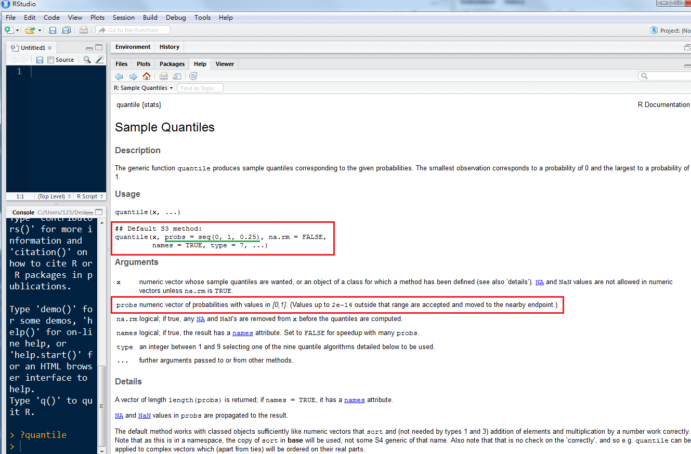
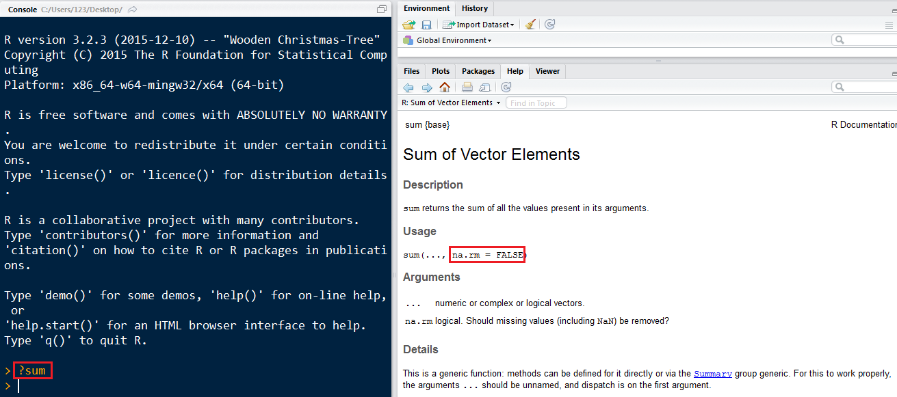
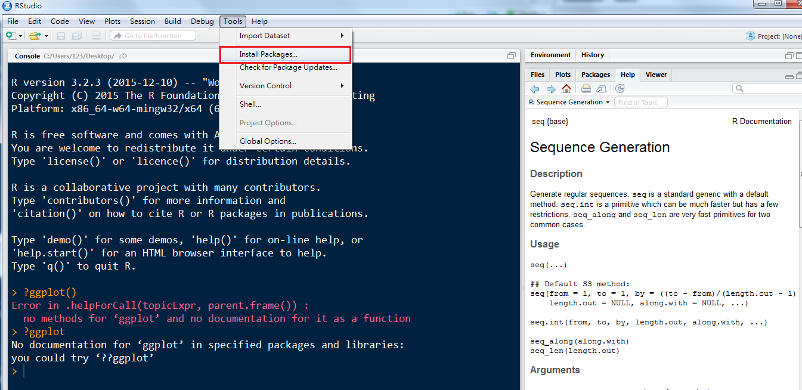

<a href="http://rpubs.com/skydome20/Table_of_Content" target="_blank">【R系列筆記】</a>   
   
------
  
   
相信現在大家對<a href="https://rpubs.com/skydome20/R-Note2-dataType" target="_blank">R語言的資料型態</a>   有一定程度的熟悉。    
但在R語言中只是第一步。若要熟練地處理/分析資料，必須要掌握另一個技巧：   
**套件(package)與函式(function)。**   
   
沒有寫過程式的人，可能對函式(function)不是那麼熟悉，但其實理解起來並不難。    
還記得國中的數學課，有一個章節叫「代數與函數」嗎？   
我們可能會根據某一道題目，建立一個f(x)=2x+3的式子對吧？這裡的f(x)，就是「函式」(函數)。   
函式之所以好用，就是因為裡面已經幫你制定好規則。   
因此，即使把不同的情況(x=2, x=3)丟入，也會根據相同的規則(f(x)=2x+3)，產出結果(f(x=2)=7, f(x=3)=9)。   
   
由於R是一個Open Source的程式語言(簡單來說，全世界的人在R語言上進行開發，撰寫自己的函式)，因此具有豐沛的函式集，也就是「套件」(package)。   
   
以下將會介紹R裡面一些實用的函式，以及如何根據自己的需求，搜尋到對應的套件並安裝。

------

#**1. 函式(function)**

##•summary()   
如果還記得的話，其實在上一篇的[文章](https://rpubs.com/skydome20/R-Note2-dataType)中，已經介紹過許多函式(`is.integer()`, `data frame()`, `c()`, `str()`...)   
其中，`str()`十分好用，尤其在了解一筆資料時或未知的變數時，能派上很大的用場。   
除此之外，還有一個相當強大、具有類似功能的函式，叫做`summary()`。   
我們先拿R內建的鳶尾花資料(iris)，比較看看`str()`和`summary()`的功用吧：
```{r}
str(iris)
summary(iris)
```
你會發現，`str()`列出資料內每個欄位的狀態，   
而`summary()`則給出每個欄位的「最大值」、「最小值」、「平均值」、「中位數」「第一四分位數」...等等。   
那麼，`str()`和`summary()`的差別究竟在哪裡呢？   
這裡要教一個實用的小技巧：**當你不清楚「一個函式的用途」、「該如何使用」時，要從哪裡找到說明文件(Help)？**   
答案很簡單！請在console裡面，輸入`?str`和`?summary`指令(如下圖)：
  

------

你會發現，在右手邊的「Help」欄位，會出現說明文件，裡面包括「函式的套件」、「函式的用途」、「參數說明」、「使用上的教學示範」...   
這個技巧，在日後會時常用到！   
**(重要觀念：當接觸一個新的函式時，第一步就是要去了解「它的用途」、以及「如何去使用」！)**   
   
(小練習)請試著在console裡，查詢`summary()`的說明文件

##•敘述統計函式   
敘述統計是進行資料分析時，有效瀏覽(explore)、了解(recognize)資料狀態的步驟。   
作為一個資料分析軟體，R裡面自然有許多可以協助我們進行敘述統計分析的函式：   

* `mean()`：平均值   
* `var()`：變異數   
* `sd()`：標準差   
* `median()`：中位數   
* `max()`：最大值   
* `min()`：最小值   
* `sum()`：綜合相加      
* `quantile()`：分位數     
* `range()`：全距    

對鳶尾花資料(iris)進行簡單的示範：   
```{r}
# 從iris的資料集中，取"Sepal.Length"(花萼長度)這個欄位的資料出來(利用神奇符號$)
iris$Sepal.Length  
```

發現到了嗎？從data frame裡面取出來的「某一欄」資料，就是一個陣列(vector)的形式。(代表每一筆觀測值的花萼長度)   
現在，就把上面這些函式，應用到這個陣列資料上吧(雖然有點無聊XD)：   
```{r, results='hold'}
mean(iris$Sepal.Length)     #「花萼長度」的平均值
var(iris$Sepal.Length)      #「花萼長度」的變異數
sd(iris$Sepal.Length)       #「花萼長度」的標準差
median(iris$Sepal.Length)   #「花萼長度」的中位數
max(iris$Sepal.Length)      #「花萼長度」中的最大值
min(iris$Sepal.Length)      #「花萼長度」中的最小值
sum(iris$Sepal.Length)      #「花萼長度」加總
range(iris$Sepal.Length)    #「花萼長度」最小值和最大值(全距)
```

然而`quantile()`這個函式有點特殊：   
```{r}
quantile(iris$Sepal.Length, probs=0.25)  # 第一四分位數 
quantile(iris$Sepal.Length, probs=0.75)  # 第三四分位數 
```

注意到了嗎？在`quantile()`這個函式裡面，除了`iris$Sepal.Length`以外，後面加了一個逗號，並且多出`probs`的參數。   
這代表什麼意思呢，當你對函式有所困惑時，就讓我們偷看一下**說明文件**吧！
    

明白了嗎？所以：   
`prob=0.25`，代表「第一四分位數」；   
`prob=0.1`，代表「在連續分布上，對應到機率0.1的那個點是多少」   
以此類推...就是這麼簡單喔！   
(話說回來，你能從說明文件中注意到，`quantile()`這個函式是屬於哪個套件嗎？**(Ans:`stats`套件)**)   

------

那如果資料裡面，有遺漏值的話呢？
```{r}
a <- c(1, 2, 3, 5, 8, 13, 21, NA, 55)
sum(a)
```

遇到資料有遺漏值的時候，函式往往會無法運作，最後結果如上面顯示是`NA`。    
但如果我們想要把「NA以外的值」加總起來，又該怎麼做？    
其實挺容易的：
```{r}
sum(a, na.rm=TRUE)
```

注意到我們在`sum()`函式裡面，多加一個參數`na.rm=TRUE`。   
其中，`na.rm`意味著"remove NA"，表示若資料裡面有遺漏值`NA`，會把它忽略，對剩下的資料進行加總。   

我們也可以查看`sum()`的說明文件，發現在函式裡面，果然有`na.rm`的參數可以設定(預設是`FALSE`)：
   

------

##•其他實用函式   
除了敘述統計的函式以外，R裡面還有一些好用的函式，常常會在處理資料時派上用場。   
以下列出個人自認好用的函式，但這裡不會多加解釋。   
若有困惑的話，先閱讀函式的說明文件，再加上自我練習，才能漸漸掌握每個函式的使用：   

##paste(), append()   
```{r, results='hold'}
# paste()：拼貼字串(把 "Happy"" 和 "White Day"" 兩個字串拼貼起來，sep代表連結字串的符號)
paste("Happy", "White-Day", sep=" ") 

# append()：把兩個vector串接起來 
b <- c(1,2,3)
c <- c(4,5,6)
append(b, c)
```

##rbind(), cbind()   
```{r}
a <- data.frame(x=c(1,2,3), y=c("Henry", "Lun", "Kevin"))
b <- data.frame(x=c(4,5,6), y=c("Helen", "Tommy", "Leon"))
rbind(a,b) # rbind()：把兩個data frame，依據row串接起來
cbind(a,b) # cbind()：把兩個data frame，依據column串接起來
```

##sample(), seq()   
```{r, results='hold'}
sample(x=1:100, size=10)  # 從1~100數字中，隨機挑10個數字，產生一個數列(vector)
seq(from=1, to=5, by=0.5) # 產生一個「從1開始，每次加0.5，直到5為止」的數列(vector)
```

##head(), tail()
```{r}
head(iris, n=6)  # head(): 顯示data frame中的前6筆資料
tail(iris, n=6)  # tail(): 顯示data frame中的後6筆資料
```

##order(), sort()
```{r}
a <- sample(x=1:100, size=10) # 從1~100數字中，隨機挑10個數字，產生一個數列(vector)
a
# 用order()，把數列由大排到小；從小排到大，decreasing = FALSE
a[order(a, decreasing=TRUE)]   
# 和 a[order(a, decreasing=TRUE)] 一樣效果
sort(a, decreasing=TRUE)      
```

##unique(), duplicated()
```{r}
a <- c("A", "B", "C", "A", "A", "B")
unique(a)       # 萃取資料中unique的element
```
```{r, results='hold'}
duplicated(a)            # 若後面有重複的資料，函式會回傳TRUE，而第一個資料會是FALSE
a[duplicated(a)==FALSE]  # 和 unique(a)一樣效果
```

##which()
```{r}
# which()：找出第幾個element是TRUE(在a裡面，第幾個element的值等於100)
a <- c(68,73,99,100,56,100,85,36)
which(a==100)
```
除此之外，網路上有人詳列出<a href="http://www3.nccu.edu.tw/~99354011/R%20commands%2811.09.13%29.pdf" target="_blank">各種好用的函式</a>的一覽表，當作參考。

------

#**2. 套件(package)**
基本上，每一個函式都有對應的套件(package)。   
不過你可能會覺得奇怪，當我們在使用上面那些函式時，似乎沒怎麼琢磨在套件上？   
那是因為，R已經將那些套件內建在裡面，因此我們可以直接呼叫(call)這些函式來使用。    
   
現在問題來了，如果我們想使用那些「沒有內建在R裡面」的函式呢？   
例如，我們想要使用一個強大的繪圖函式`ggplot()`：
```{r, error=TRUE}
ggplot(data=CO2)
```
結果R跟你說「沒有這個函數」，這代表`ggplot()`函式沒有內建在R裡面。   
因此，你得另外**(1)安裝**對應的套件(package)，並且**(2)匯入到R**裡面才可以！

------

###(1)安裝套件   
我們先求助google大神，看`ggplot()`對應到的套件是哪一個？
   
光看搜尋結果，就會發現對應的套件是**`ggplot2`**。   
不過我們還是點開這個有CRAN字樣的網站：CRAN(Comprehensive R Archive Network)，是R的官方網站之一，裡面收錄了所有經過R官方核可後的函式、以及對應的說明文件，就像這樣：   
   
因此，現在我們知道要使用`ggplot()`函式，需要先下載**`ggplot2`**套件。   

------

既然知道套件名稱，那麼就要把套件下載下來。   
下載R的套件有兩種方式：

**[1] 用RStudio介面：**   
在RStudio上點開「Tools」->「Install Packages」 ：
   
   
在中間填入想要安裝的套件名稱，點「Install」就大功告成！
   
   
**[2] 用R的函式(指令)：**   
直接在console裡面輸入函式`install.packages("套件名稱")`！
   
   
------

###(2)匯入到R   
當出現這樣的畫面，就代表安裝完成，這代表你已經把R的套件下載到電腦裡面了！    
   
 
接下來，要使用套件裡面的函式，要將套件匯入到R裡面才可以，   
這時就要用到`library()`/`require()`，用來「匯入套件」的函式：
```{r}
library(ggplot2) #匯入ggplot2套件到R裡面
ggplot(data=CO2) + geom_boxplot(data=CO2,aes(x=conc, y=uptake, colour=Plant))
 
```   

如此一來，就可以順利使用`ggplot()`函式進行繪圖囉∼   
(P.S.關於ggplot繪圖的相關細節，會在之後的的筆記中提及，請不用擔心！)   

------

#**總結**
套件和函式是R很重要的功能，但我們不可能記住所有的套件和對應的函式。   
因此，**如何妥善運用google和說明文件**，是在R的學習之路上很重要的一環！   

接下來，會進入比較接近「程式設計」的主題：條件式(if-else, switch)、迴圈(for, while)，與函式搭配的情形。   
謝謝大家！   
It's still a long way to go~   

------

#**(額外) Happy White Day**
今天恰好是3/14，祝大家白色情人節快樂！(<a href="http://stackoverflow.com/questions/8082429/plot-a-heart-in-r" target="_blank">R code from here</a>)
```{r}
require(graphics)
dat<- data.frame(t=seq(0, 2*pi, by=0.1) )
xhrt <- function(t) 16*sin(t)^3
yhrt <- function(t) 13*cos(t)-5*cos(2*t)-2*cos(3*t)-cos(4*t)
dat$y=yhrt(dat$t)
dat$x=xhrt(dat$t)
with(dat, plot(x,y, type="l"))
with(dat, polygon(x,y, col="hotpink")) 
points(c(10,-10, -15, 15), c(-10, -10, 10, 10), pch=169, font=5)
```
