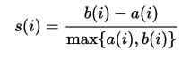

<a href="http://rpubs.com/skydome20/Table" target="_blank">【R系列筆記】</a>  

------
  
本篇內容，會繼續介紹一些常用的資料探勘模型：   
   
------
   
在分群分析中，主要可以分成兩種類型：

- 階層式分群(Hierarchical Clustering)：不需指定分群數目，讓資料自動由上往下/由下往上結合起來。   

- 分割式分群(Partitional Clustering)：需事先指定分群數目，經過不斷的迭代，直到群內的變異最小。  


------

## 1. 階層式分群(Hierarchical Clustering)   

這裡使用`iris`的資料：
```{r}
head(iris)
```     
   
由於分群屬於「非監督式學習」的演算法，   
因此我們先把`iris`內的品種(Species)欄位拿掉，以剩下的資料進行分群：   
   
```{r}
data <- iris[, -5] # 因為Species是第五欄位，故移除掉
head(data)         # 現在data只剩下前四個欄位的資料
```

在階層式分群中，主要是以資料之間的「距離」遠近，來決定兩筆資料是否接近。   
R的話，我們可以使用`dist()`，來建立資料之間的「距離矩陣」(Distance Matrix)，判斷資料之間的遠與近：   
   
```{r, message=FALSE}
E.dist <- dist(data, method="euclidean") # 歐式距離
M.dist <- dist(data, method="manhattan") # 曼哈頓距離
```   
(由於以上的矩陣太過龐大，這裡就不顯示出來，大家可以自行在自己的電腦上觀察！)   

接下來，我們就可以根據資料間的距離，來進行階層式分群，使用的函式是`hclust()`：

```{r}
par(mfrow=c(1,2)) # 讓圖片以1x2的方式呈現，詳情請見(4)繪圖-資料視覺化

# 使用歐式距離進行分群
h.E.cluster <- hclust(E.dist)
plot(h.E.cluster, xlab="歐式距離")

# 使用曼哈頓距離進行分群
h.M.cluster <- hclust(M.dist) 
plot(h.M.cluster, xlab="曼哈頓距離")
```   
      
------
   
   
當我們有了「距離矩陣」後，要如何把資料結合起來，不同的方法也會產生不同的效果。   
   
一般來說，主要有以下五種方法：   
   
   

而我們可以在`hclust()`裡面調整參數`method`，選擇不同的方法：   

```{r, results='hide'}
hclust(E.dist, method="single")   # 最近法
hclust(E.dist, method="complete") # 最遠法
hclust(E.dist, method="average")  # 平均法
hclust(E.dist, method="centroid") # 中心法
hclust(E.dist, method="ward.D2")  # 華德法
```   

那麼，在這個例子中，我們就用**歐式距離**搭配**華德法**，來進行階層式分群：   

```{r}
E.dist <- dist(data, method="euclidean")      # 歐式距離
h.cluster <- hclust(E.dist, method="ward.D2") # 華德法

# 視覺化
plot(h.cluster)
abline(h=9, col="red")
```   

由上圖，可以觀察最佳的分群數目是3個，   
因此我們可以利用`cutree()`，讓整個階層的結構縮減，變成分成三群的狀態：   
```{r}
cut.h.cluster <- cutree(h.cluster, k=3)  # 分成三群
cut.h.cluster                            # 分群結果
table(cut.h.cluster, iris$Species)       # 分群結果和實際結果比較
```
   
看起來，這次分群很成功地把**setosa**分到第一群；**versicolor**分到第二群；   
不過，**virginica**似乎遇到了點小麻煩？   

讓我們回去看原始資料的分佈情況吧：   
```{r, message=FALSE, echo=FALSE}
  require(ggplot2)
  ggplot(data=iris) +                        # 準備畫布
    geom_point(aes(x=Petal.Length,           # 散布圖
                   y=Petal.Width,
                   color=Species)) +         # 把不同品種的資料標上顏色
    
    theme_bw()                               # 改變主題背景成白色
```

果然，圖中的右上角，有一些**virginica(藍色)**和**versicolor(綠色)**靠得十分近。
   
因此他們被分到第二群也是很合理的事情！   

------

## 2. 切割式分群(Partitional Clustering)   

在切割式分群裡，最常見就是**K-Cluster**的方法，並且根據分群條件的不同，可以分成：

###1. K-Means   
使用函式是`kmeans()`：

```{r, message=FALSE}
# 分成三群
kmeans.cluster <- kmeans(data, centers=3) 

# 群內的變異數
kmeans.cluster$withinss

# 分群結果和實際結果比較
table(kmeans.cluster$cluster, iris$Species)  

# 視覺化 k-means 分群結果(基於ggplot2的語法)
require(factoextra)
fviz_cluster(kmeans.cluster,           # 分群結果
             data = data,              # 資料
             geom = c("point","text"), # 點和標籤(point & label)
             frame.type = "norm")      # 框架型態

```   

###2. K-Medoid      
使用函式是`pam()`，在`cluster`這個套件裡面：
```{r, message=FALSE}
require(cluster)

# pam = Partitioning Around Medoids
kmedoid.cluster <- pam(data, k=3) 

# 群內的變異數
kmedoid.cluster$objective

# 分群結果和實際結果比較
table(kmedoid.cluster$clustering, iris$Species) 

# 視覺化 k-medoid 分群結果(基於ggplot2的語法)
require(factoextra)
fviz_cluster(kmedoid.cluster,       # 分群結果
             data = data,           # 資料
             geom = c("point"),     # 點 (point)
             frame.type = "norm")   # 框架型態
```

------

##3. 分群的最佳數目(Optimal number of clusters)      
   
   
如今，你已經學會**階層式分群**和**切割式分群**的R語言要怎麼寫了！   

不過，在進行分群時，往往會遇到一個很重要的問題，那就是：**最佳的分群數目為何？**   

   
------
   

###(1)**Elbow Method**    

要解決這個問題，我們先回顧一下分群的目的，就是「使群內的總變異最小；使群間的總變異最大」，是吧？   

換句話說，我們只要找出一個數字n，使得資料被分成n群時，群內的總變異(SSE)會最小，那麼n = 最佳的分群數目(optimal number for clusters)！   

這樣的方法，就被稱為**Elbow Method**！   

在`factoextra`的套件裡，已經幫我們寫好函式`fviz_nbclust()`，可以讓我們實踐**Elbow Method**。   

函式`fviz_nbclust()`，是基於`ggplot2`的語法，將**Elbow Method**的結果視覺化，   
概念和主成份分析中的陡坡圖(scree plot)幾乎一模一樣，相信大家會感覺相當熟悉！      

```{r, message=FALSE}
require(factoextra)

# Elbow Method 應用在 階層式分析
# 注意：這裡使用的是hcut()，屬於factoextra套件，並非上面提的hclust()
fviz_nbclust(data, 
             FUNcluster = hcut,  # hierarchical clustering
             method = "wss",     # total within sum of square
             k.max = 12          # max number of clusters to consider
             ) + 
    
labs(title="Elbow Method for HC") +
    
geom_vline(xintercept = 3,       # 在 X=3的地方 
           linetype = 2)         # 畫一條虛線

# Elbow Method 應用在 K-Means
fviz_nbclust(data, 
             FUNcluster = kmeans,# K-Means
             method = "wss",     # total within sum of square
             k.max = 12          # max number of clusters to consider
             ) +
    
labs(title="Elbow Method for K-Means") +
    
geom_vline(xintercept = 3,        # 在 X=3的地方 
           linetype = 2)          # 畫一條垂直虛線

# Elbow Method 應用在 K-Medoid
fviz_nbclust(data, 
             FUNcluster = pam,   # K-Medoid
             method = "wss",     # total within sum of square
             k.max = 12          # max number of clusters to consider
             ) +
    
labs(title="Elbow Method for K-Medoid") +
    
geom_vline(xintercept = 3,       # 在 X=3的地方 
           linetype = 2)         # 畫一條垂直虛線
    

```   

   
------
   

###(2)**Average Silhouette Method**    

除了計算SSE以外，另一個衡量分群效果的方法，稱為平均側影法(Average silhouette Method)。  

側影系數(Silhouette Coefficient)會根據每個資料點(i)的內聚力和分散力，衡量分群的效果(quality)。   


公式如下：   

    

其中：   

- a(i) = 資料點(i)，它與群內其他資料點的平均距離   

- b(i) = 資料點(i)，它與其他群內資料點的平均距離，取最小值   

- s(i) = 側影係數，可以視為資料點(i)，在它所屬的群內是否適當的指標      

我們便利用這個方法，取每一個資料點的側影平均值(故稱Avg. Silhouette Method)，當作衡量最佳分群數目的準則！   


在R裡面，寫法和**Elbow Method**完全一模一樣，差別只在於參數`method="silhouette"`而已：   

(以下只舉K-Means為例)   
   
```{r, message=FALSE}
require(factoextra)

# Avg. Silhouette 應用在 K-Means
fviz_nbclust(data, 
             FUNcluster = kmeans,   # K-Means
             method = "silhouette", # Avg. Silhouette
             k.max = 12             # max number of clusters
             ) +
    
labs(title="Avg.Silhouette Method for K-Means") 

```

提問：為什麼這個方法建議分2群呢？(提示：和原始資料的分布型態有關。)   

   
------
   

###(4)**SOM()**    

```{r}
require(SOMbrero)


```

------   

#**總結**  

分群(Clustering)屬於非監督式學習，主要根據資料本身的特性，來進行資料分析的一種方法。   

實務上，當我們對資料還沒有深入了解時，便可以先使用分群方法，觀察潛藏在資料中的特性，再擬定後續分析的手法。   

在使用分群方法時，不同的分群數目，往往會對最後的結果有巨大的影響。   
因此找到**最佳的分群數目**，是很重要的課題！   

It's still a long way to go~   


------   


#**Reference**  
本篇筆記參考<a href="http://www.sthda.com/english/wiki/determining-the-optimal-number-of-clusters-3-must-known-methods-unsupervised-machine-learning#three-popular-methods-for-determining-the-optimal-number-of-clusters" target="_blank">Determining the optimal number of clusters: 3 must known methods - Unsupervised Machine Learning </a>、
以及<a href="https://cran.r-project.org/web/packages/SOMbrero/vignettes/doc-numericSOM.html" target="_blank">Using Self-Organizing Maps with SOMbrero to cluster a numeric dataset</a>製作而成。 
