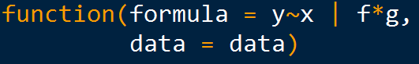

<a href="https://rpubs.com/skydome20/Table" target="_blank">返回主目錄</a>   

------

# 本篇目錄

1. [Base Plotting System](#P1)
2. [Lattice](#P2)
3. [ggplot2](#P3)
4. [儲存圖片成png,jpeg,bmp…](#P4) 
5. [總結](#P5) 
6. [(額外)資料視覺化的資源](#P6) 
   
------

經過上一篇的筆記，你已經明白<a href="https://rpubs.com/skydome20/R-Note3-function_and_package" target="_blank">R的套件與函式的概念，並且知道如何使用它們</a>。想必如今你正躍躍欲試，想趕快去找一筆實際資料，運用R語言來進行分析...這樣很好！真的！   
   
你可能已經根據前幾篇的筆記，默默開始進行練習了！   
   
而我們今天要來學習「更實用的技巧」，也是R在推出的時候，就一直被人大力稱讚的強大功能---**繪圖(Plotting)！**    
   
------
   
「繪圖」最主要目的，是把資料化為各式各樣的圖表(趨勢圖、長條圖、圓餅圖、箱型圖、複合式圖表...)，時常使用Excel的人，相信對這樣的動作並不陌生。   
   
然而，你有仔細思考過，為什麼要把資料畫成圖表嗎？   
   
事實上，這樣的動作有一個專有名詞，叫做**資料視覺化(Data Visualization)**---其牽涉的領域包括**藝術、設計、心理學、程式軟體...**毫無疑問，「資料視覺化」這個名詞，如今已經代表一門專業學科；在網路的社群上，也有來自各方人士的熱烈討論與研究。   
   
然而，對理工背景的人來說，**設計，藝術或心理學**，就像另一個世界的語言；對人文背景的人來說，**電腦，程式或軟體**，則是無法觸及的神話...   
   
不不不，千萬別這麼想。其實「資料視覺化」最基本、最主要的概念，只有一句話而已：**「降低資料的理解門檻」**。   
   
------
   
在2016/03/26，<a href="http://www.slideshare.net/tw_dsconf/ss-60041639" target="_blank">資料科學愛好者年會所舉辦的活動</a>上，台大土木系的康仕仲教授以一張圖來解釋這樣的概念：   
   
   
因此，「資料視覺化」可以在**不簡化資訊情況下**，**降低複雜資料的理解門檻**；也可以說，幫助我們**以較簡單的方式**，去**理解高維度(複雜)的資料**。   
   
------
   
資料分析前，我們需要**瀏覽資料(explore data)**，以理解資料的狀態；資料分析後，我們需要把**分析結果呈現**出來，使人容易理解。   
   
你會發現，針對以上這兩種情況，「資料視覺化」便佔了很重要的地位，對吧？因此，學好視覺化的技巧，絕對是有其必要性。   
   
在R裡面，主要有三個強大的繪圖系統(Plotting System)，可以幫助我們輕易達成「資料視覺化」的目的，以下將會一一介紹：   
   
#**1. Base Plotting System**{#P1}   
   
看到Base這個單字，就知道這是R最基本、最核心的繪圖系統。   
   
不過，可不要以為基本的東西就比較陽春！事實上，光是這最基本的繪圖系統，就已經有許多功能強大的繪圖函式了！   
   
以下都會拿R裡面，一個關於空氣品質的資料集`airquality`來進行示範：   
```{r}
require(datasets)
head(airquality)
```
   
##‧hist()
這是畫**直方圖(Histogram)**的函式。   
當我們想要看資料裡面，各個月份(Month)有多少筆資料，可以這樣使用：   
```{r}
hist(x=airquality$Month, 
     main="Histogram of Month",         # 圖片的名稱
     xlab="Month",                      # X軸的名稱
     ylab="Frequency")                  # Y軸的名稱
```
   
##‧boxplot()
這是畫**盒鬚圖(Box Plot)**的函式。   
當我們想要看資料裡面，不同月份的臭氧(Ozone)數值的分布情況，可以這樣使用：   
   
```{r}
boxplot(formula = Ozone ~ Month, # Y ~ X (代表X和Y軸要放的數值) 
        data = airquality,       # 資料
        xlab = "Month",          # X軸名稱
        ylab = "Ozone (ppb)",    # Y軸名稱
        col ="gray")             # 顏色
```
   
   
##‧plot()
這是畫**散布圖(Scatter Plot)**的函式。   
當我們想要看月份(Month)和氣溫(Temp)之間的關係，可以這樣使用：   
```{r}
plot(x=airquality$Month,            # X軸的值
     y=airquality$Temp,             # Y軸的值
     main="Month to Temperature",   # 圖片名稱
     xlab="Month(1~12)",            # X軸名稱
     ylab="Temperature(degrees F)") # Y軸名稱       
```

或者，我們想要看臭氧(Ozone)和風(Wind)之間的關係：   
```{r}
plot(x=airquality$Ozone,      # X軸的值
     y=airquality$Wind,       # Y軸的值
     main="Ozone to Wind",    # 圖片名稱
     xlab="Ozone(ppb)",       # X軸的名稱
     ylab="Wind(mph)"         # Y軸的名稱
)
```
   
很容易，對吧？   
   
事實上，當我們使用`plot()`函式時，代表我們其實在R裡面建立了一塊「畫布」(canvas)...對，就是藝術家作畫的那種畫布！   
   
既然是一塊畫布，就表示我們可以隨自己的意思，在畫布上面增一筆、撇一畫，增加我們想要的東西。   
   
因此基於這樣的觀念，在R裡面利用Base Plotting System繪圖時，可以分成「兩階段」：

**1. 創造一張圖(Creation of a plot)**

**2. 修飾這張圖(Annotation of a plot: adding lines, points, texts...)  ** 
   
下面是示範的程式碼：   

```{r, include=T}
# 建立一個畫布，上面已經有一張散布圖(Ozone to Wind)
plot(x=airquality$Ozone,
     y=airquality$Wind,
     main="Ozone to Wind",
     xlab="Ozone(ppb)",
     ylab="Wind(mph)",
     pch=16                  # 點的圖形
) 

# 現在我們要在這張圖片中，把5月的資料點用藍色標註上去
May_data <- airquality[airquality$Month==5, ]   # 找出5月的資料
  # 標上藍色的點
points(x=May_data$Ozone,                       
       y=May_data$Wind, 
       pch=16,                  # 點的圖形
       col="blue")              # 顏色

# 同理，也可以把8月的資料點用紅色標註上去
Aug_data <- airquality[airquality$Month==8, ]   # 找出8月的資料
  # 標上紅色的點
points(x=Aug_data$Ozone, 
       y=Aug_data$Wind, 
       pch=16,               # 點的圖形
       col="red")            # 顏色

# 在右上角做出標示
legend("topright",                                # 表示在右上角
       pch = 1,                                   # pch代表點的圖案
       col = c("blue", "red", "black"),           # col代表顏色 
       legend = c("May", "August", "Other Month") # 顏色所對應的名稱
       )

# 我們也可以畫出回歸趨勢線
lm.model <- lm(Wind~Ozone, airquality)    # 建立一個線性回歸
  # 畫上回歸的趨勢線
abline(lm.model,                          
       lwd=2)     # lwd 代表線的粗細
```
   
(上圖是集合所有動作的成果；建議可以在自己的電腦上，一步一步慢慢執行每一行程式，就可以看見整張圖是如何變化的。)   
   
------
   
你會發現，用`plot()`建立出一個散布圖(畫布)後，我們又運用一些函式，在畫布上面增添想要的資訊(e.g. `points()`=畫上點；`legend()`=作上標記；`abline()`=畫上線)   
   

當然，具有類似功能的函式不只這些，這裡列出一些常用的：   
   
|  函式   |         功能         |
|:-------:|:--------------------:| 
| plot    |  繪製散布圖(畫布)    | 
| lines   |  把資料點用線連接    | 
| points  |  繪製新的資料點      |    
| text    |  補充文字說明在圖上  |  
| title   |  補充主旨            |  
| mtext   |  在圖外顯示大主旨    |  
| axis    |  增加軸的labels      |  

   
------
  
當然有的時候，我們會想要同時畫兩張圖，這時候可以使用`par()`函式：

```{r}
# c(1,2)，表示建立一個1x2的空間，用來呈現後續的圖
par(mfrow = c(1,2)) 

# 第一張圖
plot(airquality$Wind, airquality$Ozone, main = "Wind to Ozone") 
# 第二張圖
plot(airquality$Solar.R, airquality$Ozone, main = "Solar.R to Ozone")

```
   
------
   
#**2. Lattice**{#P2}    
這是在R裡面第二個繪圖系統。   
   
和Base Plotting System不同的是，Lattice的繪圖概念，並不是「兩階段」，而是直接一筆在圖上繪製所有的資訊。   
   
這裡需要注意的是，使用Lattice函式的方式，和Base Plotting System不太一樣...在Lattice裡面，函式的使用主要是這樣的型態：   
   
   
R裡面有一個公式(formula)的概念，在建模或畫圖時，用來表達x和y的值，以及條件變數：  

* 在`~`左邊的，是`y`的值；在`~`右邊的，是`x`的值   

* `f`和`g`代表條件變數(condition variables)，可以省略(omit)   

* `data`的部分，則放置我們要繪圖的資料集
   
      
------
   
在使用Lattice繪圖之前，必須匯入`lattice`套件：   
```{r, message=FALSE}
require(lattice)  # 如果無法執行，請先install.packages("lattice")
```
   
##‧histogram()
這是Lattice中，畫**直方圖(Histogram)**的函式。   
當我們想要看資料(airquality)中，臭氧(Ozone)在不同月份(Month)下的狀態資訊，可以這樣使用：      
```{r}   
# 先把月份變成類別變數
airquality$Month <- as.factor(airquality$Month) 

# 繪圖
histogram(x= ~ Ozone | Month,  # 根據月份(Month)的條件，繪製臭氧(Ozone)的直方圖
          data=airquality,     
          xlab="Ozone(ppb)",  
          layout=c(5,1))       # 以5x1的方式呈現圖表
   
```  
   
   
##‧bwplot()   
這是畫**盒鬚圖(Box Plot)**的函式。     
當我們想要看資料裡面，不同月份的臭氧(Ozone)數值的分布情況，可以這樣使用：   
(可以和`boxplot()`的圖對照)      
```{r}
bwplot(x = Ozone ~ Month,      # 把Month放在X軸，Ozone放在Y軸
       data = airquality,     
       xlab = "Month"         
       )
```

##‧densityplot()
這是畫**機率密度圖**的函式。   
當我們想要看資料裡面，臭氧(Ozone)的機率密度分布關係，可以這樣使用：
```{r}
# 把Ozone放在x的值；當然，可以增加月份的條件( ~ Ozone | Month)
densityplot( ~ Ozone ,      
            data=airquality
            )
```

##‧cloud()
這是畫**3D圖**的函式。   
當我們想要看資料裡面，不同月份下，臭氧(Ozone)、氣溫(Temp)和風(Wind)之間的關係，可以這樣使用：   
```{r}
# Wind放在Z軸，Temp和Ozone放在X和Y軸，根據Month條件分別繪圖
cloud(x=Wind~Temp+Ozone | Month, 
       data=airquality         
      )
```

##‧xyplot()
這是畫**散布圖(Scatter Plot)**的函式。   
當我們想要看不同月份(Month)之間，氣溫(Temp)和風(Wind)之間的關係，可以這樣使用：   

```{r}
xyplot(x=Wind~Temp,         # Wind放在Y軸，Temp放在X軸
       data=airquality,     
       group = Month,       # 根據Month，把資料點用顏色區分開來  
       
       # auto.key參數，表示設定標籤與其他資訊
       auto.key=list(space="top",          # 位置在上方 
                     columns=5,            # 1x5的方式呈現標籤
                     title="Month Labels", # 標籤名稱
                     cex.title=1)          # 標籤字體大小
       )
```   
   
還記得在Base Plotting System裡面，當我們畫完散布圖後，可以再隨意添加各種資訊上去嗎？可惜的是，這在Lattice是行不通的。   
   
「一次把所有資訊繪在圖上」，是Lattice的精髓。而要達成這樣的目的，我們要學習一個叫`panel function`的概念。   
   
簡單來說，`panel function`是用來**控制所有發生在圖表內的資訊**，只是在寫法上會稍嫌困難一些。下面會舉兩個例子，幫助大家理解`panel function`的運用與概念：   

```{r}
# 目的:我們想要在散布圖中，畫出標示出中位數的線 #

xyplot(x=Wind~Temp | Month,  # Wind放在Y軸，Temp放在X軸，並根據Month條件分別繪圖
       data=airquality,      
       layout = c(5,1),      # 以5x1的方式呈現圖
       
       # 在這裡，我們要使用panel function，畫出中位數的線
       panel=function(x,y){  
           # function的寫法，會用大括號包起來，裡面表示要進行的動作：
           # 在這個panel function裡面，我們進行了兩個動作
           panel.xyplot(x, y)                    # 1.繪製x-y的散布圖
           panel.abline(h = median(y), lty = 2)  # 2.標示出中位數的線段
       }
       
)

```

```{r}
# 目的:我們想要在散布圖中，畫出線性回歸的趨勢線 #

xyplot(x=Wind~Temp ,         # Wind放在Y軸，Temp放在X軸
       data=airquality,     
      
       # 在這裡，我們要使用panel function，畫出線性回歸的趨勢線
       panel=function(x,y){  
           # function的寫法，會用大括號包起來，裡面表示要進行的動作：
           # 在這個panel function裡面，我們進行了三個動作
           panel.fill(col="gray")         # 1.改變背景顏色(gray)
           panel.xyplot(x, y)             # 2.繪製x-y的散布圖
           panel.lmline(x, y, col="red")  # 3.畫出線性回歸的趨勢線
       }
       
)
```
   
[這個網站](http://www.magesblog.com/2012/12/changing-colours-and-legends-in-lattice.html)有更多關於Lattice繪圖的技巧(顏色、標籤...)，有興趣的歡迎參考。
   
   
------
   
#**3. ggplot2**{#P3} 
接下來要介紹的，是在R裡面最受歡迎的第三方繪圖套件：**ggplot2**。   
   
`ggplot2`的繪圖概念，又和上面兩者不一樣，是基於**Grammar of Graphics**的想法，直譯來說，就是「圖形的文法」。     
   
這是一個十分抽象的概念。簡單來說，就是當你在用`ggplot2`繪圖的時候，要思考圖形(graphics)中的**「名詞(noun)」、「動詞(verb)」、「形容詞(adjective)」**...就是這樣的概念！   
   
在`ggplot2`中，繪圖的文法包括兩個主要屬性：   

* Aesthetic attributes (美學表現)：包括「顏色、形狀、點的大小與線的粗細」等...   

* Geometric objects (幾何屬性)：包括「點、線、盒狀圖、直條圖」等...   
   
此外，還有其他次要屬性：   

* Facets：提供在同一張圖內做多個子圖的方法，只要使用Faceting功能設定子圖分類的依據參數即可。   

* Stats：將資料做統計轉換。   

* Scales：修改點線的顏色、形狀、xy軸的範圍等   

   
------
   
使用ggplot2時，需要匯入`ggplot2`的套件，並且根據以下步驟進行繪圖：   
   
------
   
##‧qplot()
這是`ggplot2`裡面比較簡易的函式，使用上很像`plot()`的觀念，不同的是，我們可以單純利用這個函式，改變其中`geom`的參數，就能畫出**直方圖、散佈圖、合鬚圖**...等等圖形。

###**直方圖(histogram)**

```{r,warning=FALSE}
require(ggplot2)
qplot(x=Ozone,                      
      data=airquality,              
      geom="histogram",             # 圖形=histogram
      main = "Histogram of Ozone",  
      xlab="Ozone(ppb)",            
      binwidth = 25,                # 每25單位為一區隔
      fill= Month                   # 以顏色標註月份，複合式的直方圖
      )
```

###**散布圖(scatter plot)**
```{r,warning=FALSE}
qplot(x=Temp,                               
      y=Ozone,                              
      data=airquality,                      
      geom="point",                         # 圖形=scatter plot
      main = "Scatter Plot of Ozone-Temp",  
      xlab="Temp",                          
      ylab="Ozone(ppb)",                    
      color= Month                          # 以顏色標註月份，複合式的散布圖
      )
```

###**機率密度圖(density plot)**
   
```{r,warning=FALSE}
qplot(x=Temp,                             
      data=airquality,                     
      geom="density",        # 圖形=density
      xlab="Temp",                         
      color= Month           # 以顏色標註月份，複合式的機率密度圖
)

```
   
###**合鬚圖(boxplot)**

```{r,warning=FALSE}
qplot(x=Month,                               
      y=Ozone,
      data=airquality,                     
      geom="boxplot",       # 圖形=boxplot
      xlab="Temp",                          
      color= Month          # 以顏色標註月份，複合式的合鬚圖
)

```
   
------
   
`qplot()`裡面因為有許多內建的參數，因此使用起來，會讓人覺得很像是`plot()`或Lattice的繪圖函式。   
   
然而，卻也因為是內建的參數，有時候在使用`qplot()`時，會覺得有些受到限制。   
   
因此，在`ggplot2`裡面，有另外一個函式叫做`ggplot()`，就是使用**「圖形的文法」**來進行繪圖。   

比起`qplot()`，`ggplot()`需要自己進行各種設定(美學/幾何)，雖然學習上比較複雜一點，卻也因此更加有彈性(flexible)和客製化(customized)的表現。   
   
   
   
##‧ggplot()
雖然說是「圖形的文法」，但概念上和`plot()`的兩階段流程十分相似，只是這裡變成「三階段流程」： 

1. 準備好資料，用`ggplot()`建構出圖形的「畫布」(canvas)。   

2. 設定**Aesthetic attributes**：使用`aes(x, y, ...)`指定。   

3. 指定**Geometric objects**：(`geom_histogram()`、`geom_point()`、`geom_line()`、`geom_polygon()`、`geom_errorbar()`...)。   
   
(*關於第二點的「美學表現」，我們可以在建構畫布(`ggplot()`)時設定，也可以在決定幾何圖形(`geom()`)時設定，十分彈性。)   

在這裡，以airquality為例子，先單純準備好一個畫布：   
```{r}
# 準備一個畫布，資料集=airquality
canvas <- ggplot(data=airquality)
```
由於用`ggplot()`的時候，並不會輸出圖形，只是準備好畫布(canvas)而已，因此接下來我們要用`geom()`，決定要繪製何種圖表。   

###**直方圖(histogram)**
```{r,warning=FALSE}
# 方才準備的畫布
canvas +
    # 以直方圖的圖形呈現資料
    geom_histogram(aes(x=Ozone,     # X 放Ozone
                       fill=Month   # 根據月份顯示不同的顏色   
                       ) 
                   )     

```
而當我們想要每一個月份，分別畫一張直方圖的話，可以使用`facet()`函式。    
   
其參數的形式`vertical ~ horizontal`，表示圖片是要以垂直/水平的方向呈現。  
   
(更多：http://www.cookbook-r.com/Graphs/Facets_%28ggplot2%29/)
```{r,warning=FALSE}
# 方才準備的畫布
canvas +
    # 以直方圖的圖形呈現資料
    geom_histogram(aes(x=Ozone,
                       fill=Month)  # 以粉紅色填滿         
                   ) +
    
    # 用facet()，分別各畫一張各月份的直方圖
    facet_grid(.~Month)   # 因為Month放在右邊，故圖片以水平方向呈現

```

這裡有個觀念十分重要，我們其實是用`+`符號，來連接不同的圖層(canvas、幾何圖表、美學表現)，所有圖層最後會呈現在圖表上。   


###**散布圖(scatter plot)**
```{r,warning=FALSE}
# 準備畫布
ggplot(data=airquality) +   
    
    # 散布圖對應的函式是geom_point()
    geom_point(aes(x=Temp,  # 用aes()，描繪散布圖內的各種屬性
                   y=Ozone,
                   main="Scatter Plot of Ozone-Temp",
                   color=Month) 
               ) + 
    # 用geom_smooth()加上趨勢線
    geom_smooth(aes(x=Temp,
                    y=Ozone)) +
    
    # 用labs()，進行文字上的標註(Annotation)
    labs(title="Scatter of Temp-Ozone",
         x="Temp",
         y="Ozone") +
    
    # 用theme_bw(background white)，改變主題背景成白色
    # 更多背景設定： http://docs.ggplot2.org/current/ggtheme.html            
    theme_bw()          
```

我們也可以改用畫線的方式，呈現資料：

```{r, warning=F}
ggplot(data=airquality) +   
    
    # 要畫線的話，對應的函式是geom_line()
    geom_line(aes(x=Temp,  
                   y=Ozone,
                   color=Month) 
               ) +
    
    # 用labs()，進行文字上的標註(Annotation)
    labs(title="Line Plot of Temp-Ozone",
         x="Temp",
         y="Ozone") +
    
    theme_bw()

```

也可以把上面那兩張圖，合併在一起：   
   
###**複合式圖表**
   
```{r, warning=FALSE}
# 準備畫布
ggplot(data=airquality) +   
    
    # 散布圖對應的函式是geom_point()
    geom_point(aes(x=Temp,  
                   y=Ozone,
                   main="Scatter Plot of Ozone-Temp",
                   color=Month) 
               ) + 
    # 要畫線的話，對應的函式是geom_line()
    geom_line(aes(x=Temp,  
                   y=Ozone,
                   color=Month) 
               ) + 

    # 用labs()，進行文字上的標註(Annotation)
    labs(title="Combination of Scatter and Line Plots",
         x="Temp",
         y="Ozone") +
    
    theme_bw()
```


###**圓餅圖**
要用`ggplot2`畫圓餅圖，要先畫出bar plot，再沿著y軸進行轉軸：   
```{r,warning=FALSE}
# 自己定義一筆新的資料
df <- data.frame(sex=c("child", "teen", "adult", "old man"),
                 perc=c(21,53,85,8)
                 )

#準備畫布
ggplot(data=df) +
    
    # 先畫bar plot
    geom_bar(aes(x=factor(1),
                 y=perc,
                 fill=sex),
             stat = "identity"
             ) +
    
    # 再沿著Y，轉軸成圓餅圖
    coord_polar("y", start=0)
```


------

#**4. 儲存圖片成png,jpeg,bmp...**{#P4}    
如今，你已經學會如何運用R的三個繪圖系統，來畫出自己想要的圖。   
   
但當你用R畫完圖以後，它只存在於R裡面，無法自由存取。因此，我們必須把圖片儲存到自己的電腦上，這才是我們最終的目的。   
   
要用R把圖片輸出其實很簡單，例如我們要把畫好的圖片輸出成.png的型態，那我們就在前後加上`png()`和`dev.off()`，把我們繪圖的程式碼包起來，就像這樣：   
   
   
(jpeg對應的`jpeg()`，bmp對應的是`bmp()`，pdf對應的是`pdf()`)   
   
我們拿上面ggplot2畫的「複合式圖表」對它進行輸出，程式碼就像這樣：   
```{r, eval=FALSE}
#表示要儲存成png的格式
png("Combination of Plots.png", width=600, height=600)

    ##複合式圖表 ## 
    ggplot(data=airquality) +   
        
        # 散布圖對應的函式是geom_point()
        geom_point(aes(x=Temp,  
                       y=Ozone,
                       main="Scatter Plot of Ozone-Temp",
                       color=Month) 
        ) + 
        # 要畫線的話，對應的函式是geom_line()
        geom_line(aes(x=Temp,  
                      y=Ozone,
                      color=Month) 
        ) + 
        
        # 用labs()，進行文字上的標註(Annotation)
        labs(title="Combination of Scatter and Line Plots",
             x="Temp",
             y="Ozone"
        ) +
        
        theme_bw()

dev.off() #最後要關掉輸出圖片裝置 
```
   
------
   
#**總結**{#P5}    
   
這篇筆記由簡到難，介紹了三種R的繪圖系統。我們可以用不同的繪圖系統，去繪製相同效果的圖表(當然，外觀上可能會不太一樣)。雖然內容很多，學起來不太容易，不過人畢竟是視覺的生物，好好掌握資料視覺化(繪圖)的技巧，在資料分析中是一項很重要的能力。   

下一篇筆記，我們開始真正進入資料分析的過程：拿一筆實際的資料，進行一次**簡單、卻完整**的分析(包含預處理、視覺化、建模、分析報表...)。   
It's still a long way to go~   
  
------
   
#**(額外)資料視覺化的資源**{#P6} 
   
* 台灣資料科學愛好者年會的演講：<a href="http://www.slideshare.net/tw_dsconf/ss-60041639" target="_blank">[資料視覺化之理論、賞析與實作---投影片]</a>  (2016/03/26)   
  
* <a href="http://blog.infographics.tw/" target="_blank">[資料視覺化]</a> ，與其<a href="https://www.facebook.com/data.visualize/" target="_blank">[臉書專頁]</a>    

* <a href="https://www.facebook.com/taiwanstat/?fref=ts" target="_blank">[用數據看台灣]</a>   

   
