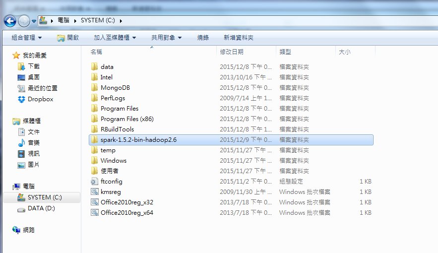

<a href="https://rpubs.com/skydome20/Table" target="_blank">返回主目錄</a>   

------

# 本篇目錄

0. [前言](#P0)
1. [解析CIA (CREST project)的網址](#P1)
2. [用xml2解析CIA搜尋結果的資訊](#P2)
    * [(1) 解密文件的「標題」和對應的「超連結」](#P2-1)
    * [(2) 共有「多少」搜尋結果](#P2-2)
    * [(3) 共有「幾頁」搜尋結果](#P2-3)
3. [下載解密文件](#P3)
4. [進階：自動化整個流程(成果展現)](#P4)
    * [basic.info.query.CIA_CREST(query)](#P4-1)
    * [parsing.pages.CIA_CREST(query, pages)](#P4-2)
    * [download.doc.CIA_CREST(parse.table)](#P4-3)
5. [總結](#P5)
6. [Reference](#P6)
------

#簡介   
**SparkR本來是由UC BERKELEY 的AMPLab(https://amplab.cs.berkeley.edu/) 所開發的一個R的套件(package)。**   
**首先在2014年的1月發佈，後來在Open Source的社群內茁壯成長。**  
**直到最近，SparkR套件正式被Apache Saprk納入到1.4版本裡。**   
**因此，現在只要下載Spark，便可直接使用R語言來操作Spark。(過去的作法，要另外從Github下載SparkR套件)**   
   
**要使用SparkR之前，需要先進行兩個步驟：**      
**(1) 安裝Spark**      
**(2) 安裝R (Rstudio)**   

___   

####**(1)**   
**Spark的安裝網址如下：https://spark.apache.org/downloads.html**   
**並且依照下圖進行設定，下載Spark壓縮檔，並將檔案解壓縮。**   
   
   
   
####**(2)**   
**Rstudio 的安裝網址如下：https://www.rstudio.com/**   
**R/Rstudio 安裝教學：https://www.dotblogs.com.tw/michael80321/2014/12/15/147656**
   
___ 
   
# ‧SparkR基本設定   
**當Spark與R安裝好以後，基本工作已經完成80%了！**   
**至於剩下的20%也不用想得太難：「要從Spark的檔案中，找到SparkR的套件來使用。」**    
**要達到以上目標，需要先在R裡面進行一些設定：使用的*Sys.setenv()*，並在裡面進行路徑設定(也就是解壓縮後的Spark檔案位置)。**     
**以下圖為例，因為Spark的檔案放在C槽，因此路徑(SPARK_HOME)就設定為 "C:\\spark-1.5.2-bin-hadoop2.6"：**   
  
   
     
###**R程式碼(環境設定)：**

```{r, message=FALSE}
# Set the system environment variables
Sys.setenv(SPARK_HOME = "C:\\spark-1.5.2-bin-hadoop2.6")
.libPaths(c(file.path(Sys.getenv("SPARK_HOME"), "R", "lib"), .libPaths())) #為了使用Spark所提供的SparkR的package
```   
   
   
___

# ‧建立Spark連結與spark_sql的資料   
   
**在使用Spark前，得先利用*sparkR.init()* 建立Spark的連結。**   
**而*sparkRSQL.init()*會建立一個Spark的DataFrame，可以想成在Spark裡，資料是以R的data.frame方式呈現。**
```{r, message=FALSE, results='hide'}
#load the Sparkr library
require(SparkR)
# Create a spark context and a SQL context
sc <- sparkR.init(master = "local")
sqlContext <- sparkRSQL.init(sc)
```
   
___
   
# ‧SparkR的基本操作   
**SparkR可以讓我們把R的data.frame，丟到Spark裡進行運算。**   
**例如，我在下面的程式碼中，先建立一個*exercise.df*(data frame)：**
```{r}
#### Create a sparkR DataFrame from a R DataFrame ####
exercise.df <- data.frame(name=c("John", "Smith", "Sarah"), age=c(19, 23, 18)) # a R_dataFrame
exercise.df
```
   
**然後利用*createDataFrame()* ，把R的DataFrame，轉變成spark的DataFrame形式。**
```{r}
spark.df <- createDataFrame(sqlContext, exercise.df) # convert R_dataFrame to spark_sql_dataFrame
head(spark.df)
printSchema(spark.df) # print out the spark_sql_dataFrame's schema
class(spark.df)
```
   
**當然，我們也可以把spark的DataFrame，變回R的DataFrame**

```{r}
r.df <- collect(spark.df)
class(r.df)
```
   
**此外，我們可以利用sql的語法，對Spark內的資料進行查詢。**   
**這裡要注意的是，使用sql語法查詢之前，必須先用*registerTempTable()*，在spark裡建立一個可查詢的table：**
```{r}
# Running SQL Queries from SparkR
registerTempTable(spark.df, "test")
sql_result <- sql(sqlContext, "SELECT name FROM test WHERE age > 19 AND age < 24")
head(sql_result)

```
   
___
    
# ‧資料處理手法   
**在資料處理上面，SparkR 支援許多R的function。**   
**這裡以黃石公園的老忠實間歇泉資料為例子：**   
```{r}
head(faithful)
spark.df <- createDataFrame(sqlContext, faithful)

```
   
   
**(1)挑選特定的欄位(Column)：**   
```{r}
# Select only the "eruptions" column
head(select(spark.df, "eruptions"))
```
**(2)根據條件式，篩選特定的資料集：**   
```{r}
# Filter the DataFrame to only retain rows with wait times shorter than 50 mins
head(filter(spark.df, spark.df$waiting < 50))
```
**(3)新增欄位/對欄位進行運算：**   
```{r}
# Convert waiting time from hours to seconds.
spark.df$waiting_secs <- spark.df$waiting * 60
head(spark.df)
```
**(4)分組計算(Grouping/Aggregate)：** 
```{r}
waiting_freq <- summarize(groupBy(spark.df, spark.df$waiting), count = n(spark.df$waiting))
head(waiting_freq) 
```
**(5)排序(sort)：**   
```{r}
sort_waiting_freq <- arrange(waiting_freq, desc(waiting_freq$count))
head(sort_waiting_freq) 
```

___
  
# ‧建立模型   
**SparkR也支援許多Machine Learning相關的模型，主要來自於Spark內建的[MLlib(Machine Learning Library)](http://spark.apache.org/docs/latest/mllib-guide.html)。**   
**這裡拿R內建的鳶尾花資料(iris)，進行回歸分析：**
```{r, warning=FALSE}
# Create the DataFrame
df <- createDataFrame(sqlContext, iris)
# Fit a linear model over the dataset.
model <- glm(Sepal_Length ~ Sepal_Width + Species, data = df, family = "gaussian")
# Model coefficients are returned in a similar format to R's native glm().
summary(model)
# Make predictions based on the model.
predictions <- predict(model, newData = df)
head(select(predictions, "Sepal_Length", "prediction"))

```

# ‧最後，別忘了關掉與Spark之間的連結噢！
```{r}
#### Stop the SparkContext ####
sparkR.stop()
```
 
___

### ‧附註
**本文是參考Spark官網上的範例進行練習，Reference from https://spark.apache.org/docs/latest/sparkr.html**   
   
**由於以上練習是在單機(windows 7)上進行，因此並沒有納入平行處理的例子。**   
**日後若有機會在多機台上架設Spark，會再補齊相關的程式碼。(2015/12/09)**   
  
     
     
      
   
   